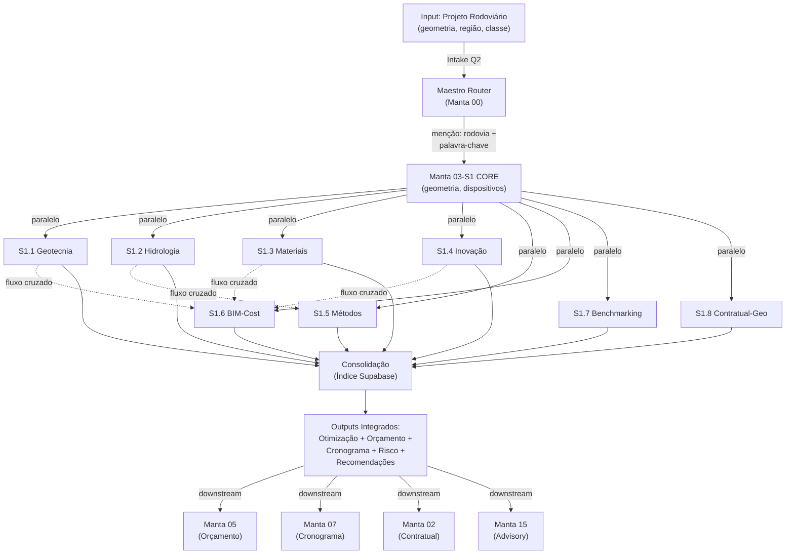

# Manta 03-S1 — Arquitetura de Integração Completa & Orquestração

**Status**: v1.0 — 8 módulos especializados  
**Data**: 2026-08-11  
**Responsável**: Mauricio Neves (mneves@mantaassociados.com)

---

## 1. VISÃO GERAL

Manta 03-S1 é o agente especializado em **Projetos de Rodovias**. Com a expansão de Q2 2026, agora funciona como um **orquestrador de 8 sub-agentes verticais**, cada um atacando um pilar técnico-econômico crítico:

| Módulo | Foco | Output Principal |
|--------|------|------------------|
| **Geotecnia** | CBR, estabilização, compactação | Recomendações de solo-cimento, espessuras |
| **Hidrologia** | Drenagem, prazos climáticos, risco chuva | Dimensões de bueiros, margem de dias perdidos |
| **Materiais** | Jazidas, transportabilidade, bota-fora | Localização ótima, custo de transporte |
| **Inovação** | WMA, RAP, geopolímero, IoT | Especificações alternativas, economia % |
| **Métodos** | Sequenciamento, equipamentos, produtividade | Cronograma realista, impacto sazonal |
| **BIM-Cost** | Civil 3D, volumes, sensibilidade | Variantes 3D, planilha SICRO dinâmica |
| **Benchmarking** | Similares, regressão de custo, parametrização | Custo unitário validado, risco controlado |
| **Contratual-Geo** | Alocação de risco, cláusulas técnicas | Matriz de risco, recomendações contratuais |

---

## 2. ARQUITETURA DE SISTEMA



---

## 3. ROUTING DE ENTRADA (Intake Q2)

Quando um usuário menciona **rodovia** + qualquer palavra-chave abaixo, o Maestro roteia automaticamente:

```
IF rodovia + ("CBR" OR "solo" OR "estabilização" OR "compactação")
   → Ativa: S1.1 Geotecnia

IF rodovia + ("drenagem" OR "bueiro" OR "chuva" OR "HEC-RAS" OR "vazão")
   → Ativa: S1.2 Hidrologia

IF rodovia + ("jazida" OR "bota-fora" OR "transportabilidade" OR "DMT")
   → Ativa: S1.3 Materiais

IF rodovia + ("WMA" OR "pavimento verde" OR "IoT" OR "asfalto inteligente" OR "RAP")
   → Ativa: S1.4 Inovação

IF rodovia + ("equipamentos" OR "produtividade" OR "sequência" OR "pista")
   → Ativa: S1.5 Métodos

IF rodovia + ("Civil 3D" OR "volumes" OR "sensibilidade" OR "variante 3D")
   → Ativa: S1.6 BIM-Cost

IF rodovia + ("benchmark" OR "similar" OR "comparação" OR "custo unitário")
   → Ativa: S1.7 Benchmarking

IF rodovia + ("cláusula" OR "risco geológico" OR "garantia" OR "alocação risco")
   → Ativa: S1.8 Contratual-Geo + S1.1 Geotecnia

IF múltiplas palavras-chave
   → Ativa múltiplos módulos em paralelo + consolidação automática
```

---

## 4. FLUXOS DE DADOS

### Fluxo A: Análise Geotécnica → Orçamento
```
Estudo Geotécnico (CBR, camadas)
  → S1.1 Geotecnia: recomenda estabilização (cal, cimento)
  → S1.3 Materiais: localiza jazida de solo, cal, cimento
  → S1.6 BIM-Cost: atualiza espessura de base conforme CBR
  → S1.5 Métodos: ajusta produtividade por tipo de solo
  → Manta 05: recomputa SICRO com materiais locais
  → Output: Custo de terraplenagem + estabilização
```

### Fluxo B: Hidrologia → Cronograma
```
Pluviometria + Traçado
  → S1.2 Hidrologia: dimensiona bueiros, valetas
  → S1.5 Métodos: impacto de dias perdidos por chuva
  → S1.8 Contratual-Geo: alocação de risco climático
  → Manta 07: insere margem de 10-15% para dias perdidos
  → Output: Cronograma com sazonalidade realista
```

### Fluxo C: Otimização (Benchmarking + Inovação)
```
Projeto Similar Identificado
  → S1.7 Benchmarking: regressão de custo ($/km)
  → S1.4 Inovação: tecnologias aplicáveis (WMA, RAP, geopolímero)
  → S1.6 BIM-Cost: sensibilidade de variantes 3D
  → S1.3 Materiais: viabilidade de RAP (jazida de fresado)
  → Manta 05/06: análise de VPL com cenários
  → Output: Economia 25-35% vs baseline
```

---

## 5. OUTPUTS CONSOLIDADOS

### 5.1 Relatório de Otimização
```
ECONOMIA POTENCIAL: 40-50%

├─ Geotecnia: estabilização com cal ................. -20%
├─ Materiais: jazida otimizada, DMT reduzido ........ -25%
├─ Inovação: WMA + RAP + geopolímero ................ -15%
├─ Métodos: sequenciamento de pistas ................ -10%
└─ Benchmarking: negociação SICRO vs similares ...... -5%

IMPACTO EM PRAZOS: -30 dias

├─ Hidrologia: drenagem bem dimensionada ......... +10 dias evitados
├─ Métodos: sequenciamento sem retrabalho ........ -20 dias
└─ Sazonalidade: planejamento período seco ....... -15 dias

RISCO: MODERADO → BAIXO

├─ Contratual-Geo: cláusulas bem definidas
├─ Benchmarking: referência de similares validada
└─ Inovação: tecnologias com track record
```

### 5.2 Artefatos Técnicos
- **Planilha SICRO dinâmica** (S1.6 BIM-Cost) com tabelas de sensibilidade
- **Cronograma integrado** (S1.5 + S1.2) com sazonalidade
- **Matriz de risco** (S1.8) com cláusulas recomendadas
- **Relatório de jazidas** (S1.3) com mapas de DMT
- **Especificações alternativas** (S1.4) com normas técnicas

---

## 6. INTEGRAÇÃO COM MANTA HORIZONTAL

| Agente | Input de S1 | Output esperado |
|--------|------------|-----------------|
| **Manta 05** (Orçamento) | Volumes, materiais, equipamentos, alternativas de inovação | SICRO otimizado, composições SICRO customizadas |
| **Manta 07** (Cronograma) | Produtividade por tipo de solo, sazonalidade, chuva | Cronograma com barras de contingência |
| **Manta 02** (Contratual) | Riscos geológicos, cláusulas técnicas recomendadas | Condições especiais de risco técnico |
| **Manta 06** (Modelagem) | Cenários de jazida, tecnologia, variantes 3D | VPL, TIR, sensibilidade |
| **Manta 15** (Advisory) | Benchmarking, inovação, viabilidade | Recomendação de viabilidade estratégica |

---

## 7. RAG CONSOLIDADA (Supabase)

Todas as 8 sub-coleções integradas em índice único, com tags contextuais:

| Contexto | Prefixo | Fonte |
|----------|---------|--------|
| Geotecnia | geo: | NBR 7181, DNER-ME, estudos DNIT, manual Manta |
| Hidrologia | hid: | HEC-RAS, ABNT, dados INMET, ANA |
| Materiais | mat: | Manuais DNIT/DER, tabelas de jazidas, bota-fora |
| Inovação | ino: | WMA técnicos, NAPA/AASHTO, RAP normas |
| Métodos | met: | MTG's, Manuais de planejamento, Caso Manta |
| BIM-Cost | bim: | Manuais Civil 3D, templates SICRO, scripts |
| Benchmarking | ben: | Base histórica Manta (50+ projetos), similares SP/RJ |
| Contratual-Geo | ctg: | Modelos de cláusulas, matriz de risco ABNT |

**Busca cruzada automática**: "CBR baixo + WMA" → combina resultados geo: + ino: + mat:

---

## 8. ROADMAP INTEGRADO (Q3-Q2 2027)

- **Q3 2026** (agora): Deploy paralelo dos 8 módulos, teste de routing, validação RAG
- **Q4 2026**: Integração de interfaces MCP, pipelines de dados automáticos, testes de cenário simples
- **Q1 2027**: Testes de cenários complexos (5+ módulos simultâneos), otimizações de performance
- **Q2 2027**: Lançamento v1.0 (Manta 03-S1 Expandida), publicação de case studies

---

## 9. MÉTRICAS DE SUCESSO

| Métrica | Meta | Status |
|---------|------|--------|
| Acurácia de custo | ±10% vs realizado | 📋 Baseline 2027 |
| Acurácia de cronograma | ±5% vs realizado | 📋 Baseline 2027 |
| Economia média | 25-35% por projeto | 📊 Q4 2026 |
| Redução de disputas contratuais | -40% vs histórico | 📊 Q4 2026 |
| Taxa de adoção | 80%+ de projetos com 3+ módulos | 📊 Q2 2027 |
| Tempo de análise | 2-3 dias vs 5-7 dias manual | 📊 Q4 2026 |

---

## 10. CONTACTS & ESCALAÇÃO

- **Maestro Router**: `manta-maestro@mantaassociados.com`
- **Manta 03-S1 Core**: `manta-03-s1@mantaassociados.com`
- **Product Owner**: Mauricio Neves `mneves@mantaassociados.com`
- **Escalação Técnica**: Tim técnico infraestrutura (Slack: #manta-s1-infra)

---

**Versão**: 1.0 | **Última atualização**: 2026-08-11  
**Próxima revisão**: Q4 2026 (após v1 alpha testing)
