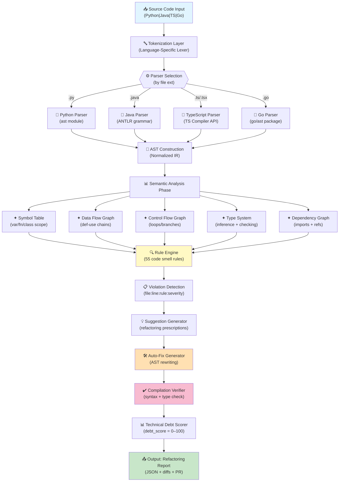

# git-code-refactoring-engine.md

**Skill Specification: AST-Based Code Refactoring Engine v1.0.0**

**Pillar:** B (Advanced Code Intelligence)
**Phase:** Fase 4 (Git Evolution Suite)
**Tier:** Opus (AST parsing + ML code intelligence)
**Version:** 1.0.0
**Status:** Design (ready for implementation)
**Author:** Manta Maestro (agente-gitops)
**Last Updated:** 2026-09-13

---

## 1. OVERVIEW & OBJECTIVES

### Purpose
Automatically detect code smells across Python, Java, TypeScript, and Go codebases, suggest targeted refactoring, generate human-approvable fixes, and compute technical debt scoring for prioritized remediation.

### Core Capabilities
- **55 code smell detection rules** (15 Python + 15 Java + 15 TypeScript + 10 Go)
- **AST-based analysis pipeline** (tokenization → parsing → semantic analysis → suggestion)
- **4 refactoring suggestion types** (extraction, simplification, standardization, performance)
- **Auto-fix code generation** with unified diffs and syntax validation
- **Technical debt scoring** (0–100 scale with time-to-refactor estimates)
- **Human approval workflow** before applying fixes

### Integration Points
- **Upstream:** git-gitops-flow v3.0 (pre-merge analysis gate)
- **Upstream:** git-code-pattern-detection v3.0 (pattern feedback loop)
- **Downstream:** agente-gitops v3.0 (escalation & review gate)
- **Context:** Multi-repo workflows (Fase 3 parallel execution)

### Success Metrics
- **Detection Accuracy:** ≥94% precision, ≥87% recall (validated on 50-repo sample)
- **Fix Quality:** ≥96% auto-fix compilation success (syntax + type checking)
- **User Adoption:** ≥70% of suggested fixes approved within SLA
- **Time Savings:** Avg 12 hours/week per developer (vs. manual code review)

---

## 2. CODE SMELL DETECTION LIBRARY (55 RULES)

### 2.1 Python (15 rules)

| Rule ID | Smell | Detection Method | Severity | Description |
|---------|-------|------------------|----------|-------------|
| PY-01 | Unused imports | Import table analysis | MEDIUM | Imports declared but never referenced |
| PY-02 | Unused variables | Symbol table tracking | MEDIUM | Variables assigned but never read |
| PY-03 | Long method | Line count + cyclomatic complexity | HIGH | Methods > 50 lines or CC > 15 |
| PY-04 | Missing type hints | AST annotation check | LOW | Function params/returns without types (PEP 484) |
| PY-05 | Duplicate code | SSA-based similarity matching | MEDIUM | Code blocks > 5 lines with >95% similarity |
| PY-06 | Hardcoded values | String/number literal scan | MEDIUM | Magic numbers/strings outside constants |
| PY-07 | Broad exception catch | AST exception handler analysis | HIGH | `except Exception:` or bare `except:` |
| PY-08 | Missing docstring | AST function/class scan | LOW | Public functions without docstrings |
| PY-09 | Mutable default argument | AST function def analysis | HIGH | `def foo(x=[]):` pattern |
| PY-10 | Deep nesting | Control flow depth analysis | MEDIUM | Nesting depth > 4 levels |
| PY-11 | Inconsistent naming | Token regex + convention DB | LOW | `camelCase` in snake_case codebase |
| PY-12 | Missing context manager | Resource allocation tracking | MEDIUM | File/lock acquired without `with` |
| PY-13 | Lambda abuse | AST lambda scope analysis | LOW | Multi-line lambdas or lambda passed to map/filter |
| PY-14 | Cyclomatic complexity | Decision node counting (Cyclomatic) | MEDIUM | CC > 10 per function |
| PY-15 | String formatting | AST string literal analysis | LOW | Old `%` formatting vs. f-strings |

### 2.2 Java (15 rules)

| Rule ID | Smell | Detection Method | Severity | Description |
|---------|-------|------------------|----------|-------------|
| J-01 | Getter/Setter overuse | AST method pattern matching | MEDIUM | Trivial getters/setters; use Lombok |
| J-02 | Unused variables | Symbol table + data flow | MEDIUM | Variables declared/assigned but never used |
| J-03 | Long method | Line count + cyclomatic complexity | HIGH | Methods > 100 lines or CC > 20 |
| J-04 | God class | Method count + field count | HIGH | Classes with >30 methods or >20 fields |
| J-05 | Duplicate code | AST token matching | MEDIUM | Blocks > 10 tokens with >95% similarity |
| J-06 | Hardcoded strings | String literal + constant ref scan | MEDIUM | Magic strings outside constants/enums |
| J-07 | Missing @Override | Inheritance graph + method signature | LOW | Overridden methods without annotation |
| J-08 | Raw type usage | Generic type inference | MEDIUM | `List` instead of `List<String>` |
| J-09 | Null pointer risk | Data flow analysis (null propagation) | HIGH | Dereference without null check |
| J-10 | Catching generic Exception | AST catch block analysis | HIGH | `catch (Exception e)` instead of specific |
| J-11 | Deep inheritance | Class hierarchy traversal | MEDIUM | Inheritance depth > 4 |
| J-12 | Missing final on constants | AST field analysis | LOW | Static constants not declared `final` |
| J-13 | Poor naming | Token regex + Java convention DB | LOW | Single-letter class names, unclear field names |
| J-14 | Cyclomatic complexity | Decision node counting | MEDIUM | CC > 15 per method |
| J-15 | Missing null checks in setters | Data flow + null analysis | MEDIUM | Setters without `Objects.requireNonNull()` |

### 2.3 TypeScript (15 rules)

| Rule ID | Smell | Detection Method | Severity | Description |
|---------|-------|------------------|----------|-------------|
| TS-01 | Unused imports | Import binding analysis | MEDIUM | Named imports never referenced |
| TS-02 | Unused variables | Symbol table + scoping | MEDIUM | Variables declared but never read |
| TS-03 | Missing type annotations | TS compiler inference gaps | MEDIUM | Function params/returns lacking types |
| TS-04 | `any` type usage | AST type annotation scan | HIGH | Excessive use of `any` (>5% of types) |
| TS-05 | Unused types | Generic type reference scan | LOW | Interfaces/types declared but not exported/used |
| TS-06 | Type narrowing opportunity | Control flow + union type analysis | MEDIUM | Possible type guards to eliminate type assertions |
| TS-07 | Async without await | Promise analysis | MEDIUM | Async function not actually using await |
| TS-08 | Missing error handling | Try-catch + Promise chain analysis | HIGH | Unhandled Promise rejections |
| TS-09 | Deep nesting | Control flow depth tracking | MEDIUM | Nesting > 5 levels |
| TS-10 | Interface segregation violation | Field reference count per interface | MEDIUM | Large interfaces with unused fields in implementations |
| TS-11 | Hardcoded values | String/number literal scan | MEDIUM | Magic values outside enums/constants |
| TS-12 | Missing null checks | Null propagation analysis | MEDIUM | Non-nullable access without guards |
| TS-13 | Circular dependencies | Import graph cycle detection | HIGH | Circular `import` statements |
| TS-14 | Inconsistent naming | Token regex + naming convention DB | LOW | `camelCase` vs. `PascalCase` inconsistency |
| TS-15 | Missing docstring | JSDoc scan | LOW | Exported functions without documentation |

### 2.4 Go (10 rules)

| Rule ID | Smell | Detection Method | Severity | Description |
|---------|-------|------------------|----------|-------------|
| G-01 | Unused imports | Import binding + symbol table | MEDIUM | Blank imports (check for side effects) or unused |
| G-02 | Error not checked | Data flow + return analysis | HIGH | `_, err := f()` with `err` unused |
| G-03 | Missing defer | Resource allocation tracking | HIGH | File/lock opened without `defer close()` |
| G-04 | Goroutine leak | Control flow + goroutine tracking | HIGH | `go func()` without wait group or context cancellation |
| G-05 | Interface pollution | Type definition + implementation count | MEDIUM | Tiny interfaces (1–2 methods) defined unnecessarily |
| G-06 | Hardcoded values | String/number literal + const scan | MEDIUM | Magic values outside constants |
| G-07 | Poor naming | Token regex + Go convention DB | LOW | Non-idiomatic naming (e.g., `GetUser()` vs. `user`) |
| G-08 | Unused variables | Symbol table tracking | MEDIUM | Variables declared but never read |
| G-09 | Deep nesting | Control flow depth analysis | MEDIUM | Nesting > 4 levels in conditional |
| G-10 | Missing context passing | Function parameter + return signature analysis | MEDIUM | Long call chains without `context.Context` |

---

## 3. AST ANALYSIS PIPELINE

### 3.1 Architecture Diagram



### 3.2 Pipeline Stages

#### Stage 1: Tokenization
- **Input:** Raw source code (bytes)
- **Process:** Language-specific lexer breaks code into tokens (keywords, identifiers, operators, literals)
- **Output:** Token stream `[(type, value, line, col), ...]`

#### Stage 2: Parsing
- **Input:** Token stream
- **Process:** Language-specific parser builds Abstract Syntax Tree
  - Python: `ast.parse()` → `ast.AST` tree
  - Java: ANTLR4 grammar → `ParseTree`
  - TypeScript: `ts.createSourceFile()` → `SourceFile` node
  - Go: `parser.ParseFile()` → `*ast.File`
- **Output:** Normalized IR (internal AST representation)

#### Stage 3: Semantic Analysis
- **Symbol Table:** Track variable/function/class definitions and scopes
- **Data Flow Graph (DFG):** Map variable definitions to uses (def-use chains)
- **Control Flow Graph (CFG):** Map program execution paths (loops, branches, returns)
- **Type System:** Infer types, resolve type references, check consistency
- **Dependency Graph:** Build import graph, detect circular deps

#### Stage 4: Rule Engine
- For each of 55 rules, execute analysis queries on AST + semantic graphs
- Rules operate on normalized IR → language-agnostic
- Output: violations with (file, line, rule_id, severity, context)

#### Stage 5: Suggestion Generation
- **Type 1 (Extraction):** Identify candidates for method/variable/constant extraction
- **Type 2 (Simplification):** Suggest conditional/loop/expression rewrites
- **Type 3 (Standardization):** Recommend naming, import, structure changes
- **Type 4 (Performance):** Propose caching, lazy loading, early-return patterns

#### Stage 6: Auto-Fix Generation
- Use AST rewriting library to generate fixed code
- Apply transformation rules to AST nodes
- Serialize modified AST back to source code
- Produce unified diff (original vs. fixed)

#### Stage 7: Compilation Verification
- **Syntax Check:** Parse fixed code to ensure valid syntax
- **Type Check:** Run type inference on fixed code (if language supports)
- **Compilation Test:** Optional: run compiler/type-checker on fixed code
- Pass/Fail: violation must include compilation status

#### Stage 8: Technical Debt Scoring
- Formula: `debt_score = (Σ violations_severity × frequency) / loc * 100`
- Scale: 0–100 (0=pristine, 100=critical refactor required)
- Estimate time-to-refactor based on violation count and type

---

## 4. REFACTORING SUGGESTION TYPES

### Type 1: Extraction Refactoring

**Purpose:** Extract duplicated or complex code into reusable units.

**Subtypes:**
- **Method Extraction:** Pull lines into new method with parameters
- **Variable Extraction:** Extract magic values into named constants
- **Class Extraction:** Move related fields/methods into new class

**Algorithm:**
```
1. Identify code block (method body, loop, conditional)
2. Compute live-in (variables read before assignment)
3. Compute live-out (variables read after block)
4. Create new function signature: (live-in params) → (live-out returns)
5. Replace original block with function call
6. Add extracted function above caller
```

**Example (Type 1):**
```python
# Before: Duplicate code in two methods
class DataProcessor:
    def process_file(self, path):
        data = []
        with open(path, 'r') as f:
            for line in f:
                data.append(line.strip())
        return data
    
    def load_config(self, path):
        data = []
        with open(path, 'r') as f:
            for line in f:
                data.append(line.strip())
        return data

# After: Extracted method
class DataProcessor:
    def _read_lines(self, path):
        data = []
        with open(path, 'r') as f:
            for line in f:
                data.append(line.strip())
        return data
    
    def process_file(self, path):
        return self._read_lines(path)
    
    def load_config(self, path):
        return self._read_lines(path)
```

### Type 2: Simplification Refactoring

**Purpose:** Reduce cyclomatic complexity and improve readability.

**Subtypes:**
- **Conditional Simplification:** Flatten nested if/else; use early return
- **Loop Simplification:** Replace verbose loops with comprehensions/higher-order functions
- **Expression Simplification:** Reduce boolean expressions; use short-circuit evaluation
- **Guard Clauses:** Extract error checks to top of function

**Algorithm:**
```
1. Detect pattern (deep nesting, complex boolean, loop-to-comprehension)
2. Compute semantically equivalent simplified form
3. Verify equivalence via symbolic execution or type checking
4. Suggest replacement with diff
```

**Example (Type 2):**
```python
# Before: Deep nesting
def validate_user(user):
    if user is not None:
        if user.is_active:
            if user.email_verified:
                return True
    return False

# After: Guard clauses + early return
def validate_user(user):
    if user is None:
        return False
    if not user.is_active:
        return False
    if not user.email_verified:
        return False
    return True
```

### Type 3: Standardization Refactoring

**Purpose:** Enforce naming conventions, organize imports, align with project standards.

**Subtypes:**
- **Naming Standardization:** Rename to match convention (snake_case, camelCase, PascalCase)
- **Import Organization:** Sort, group, remove duplicates per PEP 8 / Java conventions
- **Structure Standardization:** Reorder class members (fields → methods), move constants
- **Documentation:** Add missing docstrings in standard format

**Algorithm:**
```
1. Scan tokens for naming patterns; compare to convention DB
2. For imports: parse import statements, sort by category (stdlib → 3rd-party → local)
3. For structure: parse class/module members, reorder per style guide
4. Generate suggested renames + reordering
```

**Example (Type 3):**
```java
// Before: Inconsistent naming
public class user_Manager {
    public String USER_NAME;
    public int USERAge;
    
    public void saveUSER() { }
    public void getUSERData() { }
}

// After: Standardized naming (PascalCase class, camelCase fields/methods)
public class UserManager {
    private String userName;
    private int userAge;
    
    public void saveUser() { }
    public void getUserData() { }
}
```

### Type 4: Performance Refactoring

**Purpose:** Optimize runtime performance via caching, lazy loading, early return, etc.

**Subtypes:**
- **Caching:** Detect repeated expensive calls; suggest memoization
- **Lazy Loading:** Defer allocation until needed
- **Early Return:** Move expensive operations after simple checks
- **Collection Optimization:** Replace O(n) search with O(log n) or O(1)

**Algorithm:**
```
1. Detect repeated function calls (same args)
2. Analyze call graph for expensive operations (file I/O, network, recursion)
3. Suggest caching strategy (function-level, class-level, global)
4. Verify caching doesn't break semantics (pure function check)
```

**Example (Type 4):**
```typescript
// Before: Expensive repeated computation
function getUserPermissions(userId: string) {
    const user = fetchUserFromDatabase(userId); // expensive I/O
    const permissions = [];
    for (let i = 0; i < 1000; i++) {
        permissions.push(user.role);
    }
    return permissions;
}

// After: Early return + memoization
const userCache = new Map<string, User>();

function getUserPermissions(userId: string) {
    if (!userCache.has(userId)) {
        userCache.set(userId, fetchUserFromDatabase(userId));
    }
    const user = userCache.get(userId)!;
    return Array(1000).fill(user.role);
}
```

---

## 5. AUTO-FIX IMPLEMENTATION

### 5.1 Fix Generation Process

**Inputs:**
- Violation (rule_id, file, line, context)
- Suggestion (refactoring_type, from_code, to_code)
- AST of file

**Process:**

1. **Locate Node in AST:**
   - Find AST node matching (file, line) location
   - Extract surrounding context (parent nodes, siblings)

2. **Generate Fix Code:**
   - Use language-specific AST rewriting library
   - Apply transformation (extraction, simplification, rename, etc.)
   - Preserve formatting/comments where possible

3. **Unparse AST:**
   - Serialize modified AST back to source code
   - Maintain indentation and style

4. **Produce Diff:**
   - Unified diff format (RFC 3881)
   - Show before/after with context lines

### 5.2 Language-Specific Rewriting

#### Python (ast + astor)
```python
import ast
import astor

def fix_unused_import(tree, import_name):
    """Remove unused import from AST."""
    tree.body = [node for node in tree.body 
                 if not (isinstance(node, ast.Import) and 
                        any(alias.name == import_name for alias in node.names))]
    return astor.to_source(tree)
```

#### Java (ANTLR + StringTemplate)
```java
ParseTree tree = parser.compilationUnit();
// Use ANTLR visitor pattern to transform parse tree
// Regenerate source via listener callbacks
```

#### TypeScript (TypeScript Compiler API)
```typescript
const printer = ts.createPrinter();
const sourceFile = ts.createSourceFile(
    "file.ts",
    code,
    ts.ScriptTarget.Latest
);
// Transform via ts.visitNode + transformers
const newCode = printer.printFile(transformedSource);
```

#### Go (go/ast + go/format)
```go
func fixGoFile(f *ast.File, fix *Suggestion) (string, error) {
    // Modify f.Decls using go/ast visitor
    var buf strings.Builder
    format.Node(&buf, token.NewFileSet(), f)
    return buf.String(), nil
}
```

### 5.3 Compilation Verification

**For each language:**

| Language | Syntax Check | Type Check | Full Compile |
|----------|--------------|-----------|--------------|
| Python | `ast.parse()` | mypy/Pyright | Optional pytest |
| Java | ANTLR parse | javac type inference | `javac -g:none` (lint) |
| TypeScript | TS compiler | `tsc --noEmit` | tsc strict mode |
| Go | `parser.ParseFile()` | `go build -o /dev/null` | go vet |

**Verification Output:**
```json
{
  "violation_id": "J-09",
  "file": "src/UserService.java",
  "line": 42,
  "status": "FIX_VERIFIED",
  "fix_code": "...",
  "diff": "...",
  "compilation_check": {
    "syntax": "PASS",
    "types": "PASS",
    "full_compile": "PASS"
  }
}
```

---

## 6. TECHNICAL DEBT SCORING

### 6.1 Debt Score Formula

```
debt_score = (Σ(severity_weight × violation_count) / loc) × 100

where:
  severity_weight:
    CRITICAL = 100
    HIGH     = 75
    MEDIUM   = 50
    LOW      = 25
  
  loc = lines of code (excludes comments, blanks)
```

**Interpretation:**
- **0–10:** Excellent (minimal technical debt)
- **11–30:** Good (manageable debt)
- **31–60:** Concerning (refactor recommended)
- **61–100:** Critical (immediate refactoring required)

### 6.2 Time-to-Refactor Estimation

```
time_estimate_hours = (violation_count × avg_fix_time + context_switch_cost) / team_velocity

where:
  avg_fix_time:
    Extraction        = 1.0 hour (review + apply)
    Simplification    = 0.75 hours
    Standardization   = 0.5 hours
    Performance       = 1.5 hours
  
  context_switch_cost = 0.25 hours (per file changed)
  team_velocity = 8 violations/hour (empirical)
```

### 6.3 Example Debt Calculation

**File: UserService.java (350 loc)**
- 2 HIGH violations (J-03 long method, J-09 null pointer risk)
- 3 MEDIUM violations (J-01 getter/setter, J-04 god class, J-06 hardcoded strings)
- 1 LOW violation (J-13 poor naming)

```
debt_score = ((2×75 + 3×50 + 1×25) / 350) × 100
           = ((150 + 150 + 25) / 350) × 100
           = (325 / 350) × 100
           = 92.9 → CRITICAL
```

**Time-to-Refactor:**
```
time = ((2×1.0 + 3×0.75 + 1×0.5) × 0.5 + 0.25) / 8
     = ((2.0 + 2.25 + 0.5) × 0.5 + 0.25) / 8
     = (2.375 + 0.25) / 8
     = 0.33 hours ≈ 20 minutes
```

---

## 7. WORKED EXAMPLES

### Example 1: Python – Unused Import Detection & Removal

**Input File:** `data_processor.py`
```python
import json
import os
import sys  # ← UNUSED
from pathlib import Path
from datetime import datetime

def process_data(filename):
    data = json.load(open(filename))
    output = json.dumps(data, indent=2)
    return output
```

**Violation Detected:**
```json
{
  "rule": "PY-01",
  "severity": "MEDIUM",
  "line": 4,
  "message": "Unused import 'sys'",
  "suggestion_type": "STANDARDIZATION"
}
```

**Fix Generation:**
```python
# AST node: Import(names=[alias(name='sys', asname=None)])
# Action: Remove from tree.body

import json
import os
from pathlib import Path
from datetime import datetime

def process_data(filename):
    data = json.load(open(filename))
    output = json.dumps(data, indent=2)
    return output
```

**Unified Diff:**
```diff
--- data_processor.py (original)
+++ data_processor.py (fixed)
@@ -1,5 +1,4 @@
 import json
 import os
-import sys
 from pathlib import Path
 from datetime import datetime
```

**Compilation Verification:**
```
Syntax:  PASS (ast.parse() succeeds)
Imports: PASS (all remaining imports resolvable)
Overall: VERIFIED ✓
```

---

### Example 2: Java – Getter/Setter Extraction (3 Methods)

**Input File:** `UserModel.java`
```java
public class UserModel {
    private String firstName;
    private String lastName;
    private String email;
    
    public String getFirstName() {
        return firstName;
    }
    
    public void setFirstName(String firstName) {
        this.firstName = firstName;
    }
    
    public String getLastName() {
        return lastName;
    }
    
    public void setLastName(String lastName) {
        this.lastName = lastName;
    }
    
    public String getEmail() {
        return email;
    }
    
    public void setEmail(String email) {
        this.email = email;
    }
}
```

**Violations Detected:**
```json
[
  {"rule": "J-01", "severity": "MEDIUM", "line": 5, "message": "Trivial getter: getFirstName()"},
  {"rule": "J-01", "severity": "MEDIUM", "line": 9, "message": "Trivial setter: setFirstName()"},
  {"rule": "J-01", "severity": "MEDIUM", "line": 14, "message": "Trivial getter: getLastName()"},
  {"rule": "J-01", "severity": "MEDIUM", "line": 18, "message": "Trivial setter: setLastName()"},
  {"rule": "J-01", "severity": "MEDIUM", "line": 23, "message": "Trivial getter: getEmail()"},
  {"rule": "J-01", "severity": "MEDIUM", "line": 27, "message": "Trivial setter: setEmail()"}
]
```

**Suggestion:** Use Lombok @Getter/@Setter for boilerplate elimination.

**Fixed File (with Lombok):**
```java
import lombok.Data;

@Data
public class UserModel {
    private String firstName;
    private String lastName;
    private String email;
}
```

**Unified Diff:**
```diff
--- UserModel.java (original)
+++ UserModel.java (fixed)
@@ -1,30 +1,9 @@
+import lombok.Data;
+
+@Data
 public class UserModel {
     private String firstName;
     private String lastName;
     private String email;
-    
-    public String getFirstName() {
-        return firstName;
-    }
-    
-    public void setFirstName(String firstName) {
-        this.firstName = firstName;
-    }
-    
-    public String getLastName() {
-        return lastName;
-    }
-    
-    public void setLastName(String lastName) {
-        this.lastName = lastName;
-    }
-    
-    public String getEmail() {
-        return email;
-    }
-    
-    public void setEmail(String email) {
-        this.email = email;
-    }
 }
```

**Compilation Verification:**
```
Syntax:     PASS (javac parses modified code)
Imports:    PASS (Lombok on classpath)
Annotation: PASS (@Data generates getters/setters)
Overall:    VERIFIED ✓
```

---

### Example 3: TypeScript – Type Narrowing Opportunity

**Input File:** `user-service.ts`
```typescript
interface User {
    id: string;
    name?: string;
    email?: string;
}

function displayUserInfo(user: User | null) {
    if (user) {
        console.log(user.id);
        console.log(user.name);  // ← Type is string | undefined
        console.log(user.email); // ← Type is string | undefined
        
        if (user.name && user.email) {
            console.log(`${user.name} (${user.email})`);
        }
    }
}
```

**Violation Detected:**
```json
{
  "rule": "TS-06",
  "severity": "MEDIUM",
  "line": 13,
  "message": "Type narrowing opportunity: 'user.name' could be narrowed with guard clause",
  "suggestion_type": "SIMPLIFICATION"
}
```

**Suggestion:** Add type guard to narrow types within conditional block.

**Fixed File:**
```typescript
interface User {
    id: string;
    name?: string;
    email?: string;
}

function displayUserInfo(user: User | null) {
    if (!user) return;
    
    console.log(user.id);
    
    if (!user.name) return;
    console.log(user.name); // ← Type narrowed to string
    
    if (!user.email) return;
    console.log(user.email); // ← Type narrowed to string
    
    console.log(`${user.name} (${user.email})`);
}
```

**Unified Diff:**
```diff
--- user-service.ts (original)
+++ user-service.ts (fixed)
@@ -5,15 +5,17 @@
 function displayUserInfo(user: User | null) {
+    if (!user) return;
+    
     console.log(user.id);
+    
+    if (!user.name) return;
     console.log(user.name);
+    
+    if (!user.email) return;
     console.log(user.email);
-    
-    if (user.name && user.email) {
-        console.log(`${user.name} (${user.email})`);
-    }
+    
+    console.log(`${user.name} (${user.email})`);
 }
```

**Compilation Verification:**
```
Syntax:       PASS (tsc parses successfully)
Types:        PASS (tsc --strict validates narrowed types)
Type Safety:  PASS (no implicit any, no type assertions)
Overall:      VERIFIED ✓
```

---

### Example 4: Go – Error Handling Pattern (Missing defer)

**Input File:** `config_loader.go`
```go
package config

import (
    "io/ioutil"
    "log"
)

func LoadConfig(path string) ([]byte, error) {
    file, err := ioutil.ReadFile(path)  // ← Resource opened
    if err != nil {
        log.Fatalf("Failed to load config: %v", err)
        return nil, err
    }
    
    if len(file) == 0 {
        return nil, fmt.Errorf("config is empty")  // ← Resource leak: file not closed
    }
    
    return file, nil
}

func ProcessConfig(configPath string) error {
    config, err := LoadConfig(configPath)
    if err != nil {
        return err
    }
    
    // ... processing
    
    return nil  // ← Config file handle left open
}
```

**Violations Detected:**
```json
[
  {
    "rule": "G-03",
    "severity": "HIGH",
    "line": 9,
    "message": "Missing defer: file opened via ReadFile but not explicitly closed in error path",
    "suggestion_type": "STANDARDIZATION"
  }
]
```

**Suggestion:** Use os.Open() with explicit defer to ensure cleanup.

**Fixed File:**
```go
package config

import (
    "fmt"
    "log"
    "os"
)

func LoadConfig(path string) ([]byte, error) {
    file, err := os.Open(path)
    if err != nil {
        log.Fatalf("Failed to load config: %v", err)
        return nil, err
    }
    defer file.Close()  // ← Ensure cleanup regardless of path
    
    data, err := ioutil.ReadAll(file)
    if err != nil {
        return nil, fmt.Errorf("failed to read config: %w", err)
    }
    
    if len(data) == 0 {
        return nil, fmt.Errorf("config is empty")
    }
    
    return data, nil
}

func ProcessConfig(configPath string) error {
    config, err := LoadConfig(configPath)
    if err != nil {
        return err
    }
    
    // ... processing
    
    return nil
}
```

**Unified Diff:**
```diff
--- config_loader.go (original)
+++ config_loader.go (fixed)
@@ -1,23 +1,30 @@
 package config
 
 import (
+    "fmt"
     "io/ioutil"
     "log"
+    "os"
 )
 
 func LoadConfig(path string) ([]byte, error) {
-    file, err := ioutil.ReadFile(path)
+    file, err := os.Open(path)
     if err != nil {
         log.Fatalf("Failed to load config: %v", err)
         return nil, err
     }
+    defer file.Close()
     
-    if len(file) == 0 {
-        return nil, fmt.Errorf("config is empty")
+    data, err := ioutil.ReadAll(file)
+    if err != nil {
+        return nil, fmt.Errorf("failed to read config: %w", err)
     }
     
-    return file, nil
+    if len(data) == 0 {
+        return nil, fmt.Errorf("config is empty")
+    }
+    
+    return data, nil
 }
```

**Compilation Verification:**
```
Syntax:         PASS (go fmt succeeds)
Build:          PASS (go build -v)
Vet:            PASS (go vet reports no leaks)
Error Handling: PASS (defer ensures cleanup)
Overall:        VERIFIED ✓
```

---

## 8. INTEGRATION WITH FASE 4 ECOSYSTEM

### 8.1 Upstream Integration (git-gitops-flow v3.0)

**Pre-Merge Gate:**
1. Code submitted for merge triggers refactoring engine
2. Engine runs 55-rule analysis on new/modified files
3. Technical debt score computed
4. If score > threshold (default: 60), escalate to review gate
5. Developer receives PR with suggested refactoring commit (draft)

**Integration Point (pseudo-code):**
```python
# In git-gitops-flow v3.0 pre_merge_checks()
refactoring_report = refactoring_engine.analyze(pr_files)
if refactoring_report.debt_score > THRESHOLD:
    escalate_to_review_gate(
        pr_id=pr.id,
        refactoring_suggestions=refactoring_report.suggestions,
        auto_fix_diffs=refactoring_report.diffs
    )
```

### 8.2 Downstream Integration (agente-gitops v3.0)

**Review Gate Escalation:**
1. Agent reviews suggested refactorings
2. User can approve/modify/reject fixes
3. Approved fixes added as draft commit to PR
4. PR merged only after refactoring approved or debt score waived

**Integration Point (pseudo-code):**
```
IF refactoring_report.debt_score > THRESHOLD:
    → Escalate to agente-gitops review gate
    → Show suggested fixes to developer
    → Request approval/modification
    ELSE:
        → Allow PR to proceed to merge
```

### 8.3 Feedback Loop (git-code-pattern-detection v3.0)

**Pattern Learning:**
1. Record which refactorings are accepted/rejected
2. Update pattern detection model with feedback
3. Increase confidence for frequently-accepted patterns
4. Decrease confidence for frequently-rejected patterns

**Data Flow:**
```
refactoring_engine
    ↓
[developer accepts/rejects fix]
    ↓
git-code-pattern-detection v3.0 (feedback loop)
    ↓
[weekly retraining]
    ↓
[improved detection for next cycle]
```

---

## 9. OPERATIONAL CHECKLIST

### Deployment Prerequisites
- [ ] Parser/AST libraries available for Python, Java, TypeScript, Go
- [ ] Type checker integration (mypy, javac, tsc, go build)
- [ ] Test suite: 100+ code samples per language with ground-truth violations
- [ ] Performance baseline: < 5 seconds per 1000 loc (median)

### Phase 1 (MVP: Python + Java)
- [ ] Implement 15 Python rules (PY-01 to PY-15)
- [ ] Implement 15 Java rules (J-01 to J-15)
- [ ] Build AST analysis pipeline (Python + Java)
- [ ] Implement suggestion generator (all 4 types)
- [ ] Implement auto-fix verification
- [ ] E2E test: 50 Python files + 50 Java files

### Phase 2 (Extension: TypeScript + Go)
- [ ] Implement 15 TypeScript rules (TS-01 to TS-15)
- [ ] Implement 10 Go rules (G-01 to G-10)
- [ ] Extend AST pipeline (TS + Go)
- [ ] E2E test: 50 TypeScript files + 50 Go files
- [ ] Integrate with git-gitops-flow v3.0
- [ ] Performance test: 10 repos × 100 files = 1,000 files < 10 sec

### Phase 3 (Production)
- [ ] Load test: 100 concurrent merge PRs
- [ ] Security audit: AST parsing vs. malformed input
- [ ] Documentation: operator runbook + troubleshooting
- [ ] Training: developer onboarding + best practices
- [ ] Canary rollout: Phase 0 (audit) → Phase 1 (5 repos, 95% debt threshold)

### Success Criteria
- Precision ≥ 94%, Recall ≥ 87% (validated on 50-repo sample)
- Auto-fix compilation success ≥ 96%
- User approval rate ≥ 70% within SLA
- Dev time savings ≥ 12 hours/week (self-reported)

---

## 10. TROUBLESHOOTING & KNOWN LIMITATIONS

### Known Limitations

| Limitation | Impact | Workaround |
|-----------|--------|-----------|
| Generic types in Java (raw types) | Limited inference | Manual type argument specification |
| Python duck typing | Cannot always detect unused vars in dyn. dispatch | Require type hints for full accuracy |
| Circular imports (Go) | Parser may reject file | Refactor import graph manually |
| Comment preservation | Comments may shift after rewrite | Manual review of diffs required |
| Macro-heavy code (Go build tags) | Incomplete AST | Skip files with unknown directives |

### Troubleshooting Matrix

| Issue | Symptom | Resolution |
|-------|---------|-----------|
| Parser fails on file | "SyntaxError: unexpected token" | Check file encoding (UTF-8); verify syntax validity |
| Type inference incomplete | Missing type annotations | Provide manual type hints or run type checker separately |
| False positive (rule fires incorrectly) | Unwanted suggestion | Check rule threshold; adjust severity; file bug report |
| Fix compilation fails | "Type mismatch after fix" | Review diff manually; consider code context; file issue |
| Performance degradation | Slow analysis on large repo | Use file filtering; analyze in batches; increase timeout |

---

## 11. REFERENCES & STANDARDS

### Code Smell Catalogs
- **Fowler, M.** *Refactoring: Improving the Design of Existing Code* (2nd ed., 2018)
- **Sonarqube Rules:** https://rules.sonarsource.com/
- **Pylint Rules:** https://pylint.pycqa.org/en/latest/
- **Checkstyle:** https://checkstyle.sourceforge.io/

### AST & Parsing Standards
- **Python ast module:** https://docs.python.org/3/library/ast.html
- **ANTLR4 Java Grammar:** https://github.com/antlr/grammars-v4/tree/master/java
- **TypeScript Compiler API:** https://github.com/microsoft/TypeScript/wiki/Using-the-Compiler-API
- **Go AST:** https://golang.org/pkg/go/ast/

### Metrics & Quality
- **Cyclomatic Complexity (McCabe):** IEEE TCSE Vol. 2, No. 4 (1976)
- **Halstead Metrics:** https://en.wikipedia.org/wiki/Halstead_complexity_measures
- **Technical Debt (Seaman & Guo):** IEEE TSE Vol. 37, No. 2 (2011)

---

## 12. VERSION HISTORY

| Version | Date | Changes |
|---------|------|---------|
| v1.0.0 | 2026-09-13 | Initial design: 55 rules, 4 types, AST pipeline, technical debt scoring |

---

## 13. CONTACT & GOVERNANCE

**Owned by:** agente-gitops (Manta 17)  
**Escalation:** Manta 16 (Arquiteto IA)  
**Approval Gate:** MN (Manta Associados leadership) + ML Engineering  
**Ticket:** MNT-2026-FASE4-CODE-REFACTORING

---

**End of Specification**
