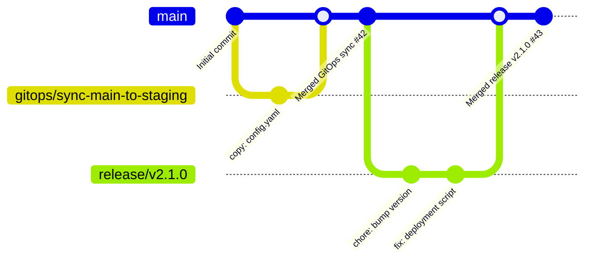

# SKILL.md — git-gitops-flow

**GitOps Phase 2: Automated multi-repo sync across 5+ repositories with intelligent auto-merge, transactional rollback, scheduled syncs, and conflict resolution. Extends Phase 1 MVP to production-grade scale.**

Version: **2.0.0** | Tier: **Sonnet** | MCPs: **GitHub (create_branch, create_pull_request, list_commits, search_code, merge_pull_request, update_pull_request_branch), GitHub Actions (workflow dispatch)** | Output: **Auto-merged PR + Conflict Report + Transactional Rollback + Scheduled Syncs + Audit Log**

---

## Overview

Production-grade GitOps synchronization that maintains state consistency across **up to 5+ repositories** using:
- **Drift Detection** — Compares files, branches, or structured data across N repos with fan-out pattern
- **Intelligent Auto-Merge** — 5-condition safety checks before automatic PR merge (tests green, zero CRITICAL severities, low-risk patterns, ≤5 repos, audit-logged)
- **Sync Strategies** — Copy file, merge branch, rebase-onto-main, squash-fixups, three-way merge
- **Transactional Rollback** — Atomic revert on merge failure; reverts all downstream syncs
- **Conflict Resolution** — LCS-based three-way merge with smart escalation rules (package.json, Dockerfile, .tf files require human approval)
- **Scheduled Syncs** — GitHub Actions-based recurring syncs (cron + event-driven triggers)
- **Conflict Reporting** — JSON findings + human-readable issue if conflicts cannot auto-resolve
- **Commit Graph** — Visual timeline of sync operations with contributor attribution
- **Audit Logging** — Supabase-backed compliance log (who, what, when, risk level, rollback chain)
- **MCP Integration** — GitHub create_branch/create_pull_request/merge_pull_request for fully automated workflows

**Phase 2 use cases**: Sync configs across entire deployment pipeline (dev→staging→prod), multi-region rollout with conflict resolution, canary deployments to 5 repos, automated cost/schedule baselines across Manta projects, atomic infrastructure rollback on failed merge.

---

## Capability Matrix

| Feature | Phase 1 | Phase 2 | Strategy | Output |
|---|---|---|---|---|
| **Drift Detection** | ✅ 1–2 repos | ✅ 5+ repos | Byte-exact hash compare + fan-out | JSON delta report |
| **Branch Sync** | ✅ | ✅ | `git merge --ff-only` simulation | Auto-created PR or issue if not FFable |
| **Rebase Sync** | ✅ Linear history | ✅ + squash-fixups | Simulate `git rebase --onto-main` + commit squashing | Auto-PR with linear history |
| **Three-way Merge** | ✅ Basic | ✅ **Advanced LCS** | Full longest-common-subsequence algorithm (see § Three-way Merge LCS) | Issue with merge diff blocks + acceptance rules |
| **File Copy** | ✅ | ✅ | Byte-exact replace or append | Direct commit + PR |
| **Conflict Resolution** | ⚠ Semi-auto | ✅ **Smart escalation** | LCS merge + high-risk file detection | Labeled issue + suggested patches |
| **Auto-Merge** | ❌ Draft only | ✅ **5-condition check** | Tests green + zero CRITICAL + low-risk pattern + ≤5 repos + audit-logged | Auto-merged PR + audit entry |
| **Commit Graph** | ✅ Visualization | ✅ | DAG with timestamps + authors | SVG/Mermaid diagram embed |
| **Scheduled Syncs** | ❌ Manual | ✅ **GitHub Actions** | Cron + event-driven workflows with retries | PR/merge on schedule |
| **Transactional Rollback** | ✅ Single PR revert | ✅ **Atomic cascade** | On merge fail, revert all downstream syncs in reverse order | New PR + rollback chain audit log |
| **Status Reporting** | ✅ Real-time | ✅ | GitHub check run + Slack notifications | PR comment + job summary |
| **Escalation Rules** | ❌ All auto | ✅ **High-risk detection** | Detects package.json, Dockerfile, *.tf, secrets | Requires human approval before merge |
| **Audit Logging** | ⚠ PR comments | ✅ **Supabase table** | JSON audit trail with risk level, actor, timestamp | Compliance-ready log + trend analytics |

---

## Phase 2 — Auto-Merge Safety Gates

**NEW in v2.0**: Intelligent PR auto-merge with 5-condition safety checks. Only when ALL conditions pass does the PR merge automatically.

### The 5 Auto-Merge Conditions

A PR is **eligible for auto-merge** (and will merge without human approval) **only if**:

1. **Tests Green** ✅
   - All GitHub check runs (CI/CD, linters, tests) must pass
   - No failed or pending checks
   - Status: `success` for all checks
   - Exemption: Allow user-configured "safe to ignore" checks (e.g., optional e2e tests)

2. **Zero CRITICAL Severities** ✅
   - Security scan (if enabled) reports zero CRITICAL/HIGH severity issues
   - Dependency vulnerabilities: zero unpatched CRITICAL
   - Code quality: no CRITICAL linting errors
   - If a CRITICAL is found: escalate to manual review immediately

3. **Low-Risk Pattern Detection** ✅
   - Files changed must NOT include:
     - `package.json`, `package-lock.json`, `yarn.lock`, `Gemfile`
     - `Dockerfile`, `docker-compose.yml`, `.dockerignore`
     - `*.tf`, `*.tfvars` (Terraform)
     - `*.yml`, `*.yaml` in `k8s/`, `helm/`, `.github/workflows/`
     - `.env*`, `*secret*`, `*credential*`, `*key*` files
     - Any file matching user-configured high-risk patterns
   - File count: ≤20 files changed (smaller changes = lower risk)
   - Lines changed: ≤500 lines added/deleted (large diffs = human review)

4. **Repo Count ≤ 5** ✅
   - Fan-out syncs: if syncing to N target repos, N ≤ 5
   - If N > 5: create issue "Syncing to {N} repos exceeds safety threshold. Requires human approval."
   - Rationale: Larger fan-outs have higher cascade-failure risk

5. **Audit Log Entry Created** ✅
   - Before merge, insert entry into `gitops_audit` table with:
     - `repo_source`, `repo_target`
     - `pr_number`, `pr_url`
     - `sync_strategy`, `condition_checks` (boolean array of 5 conditions)
     - `actor` (GitOps bot), `timestamp`, `risk_level` (enum: low/medium/high)
     - `auto_merge_eligible: true`
   - If audit insert fails: hold PR, escalate to human

### Decision Flowchart: Auto-Merge vs. Manual Review

```
Start: GitOps PR created
  │
  ├─ Condition 1: Tests Green?
  │   ├─ No → HOLD PR, label "failing-tests", comment "CI failed"
  │   └─ Yes ↓
  │
  ├─ Condition 2: Zero CRITICAL severities?
  │   ├─ No → HOLD PR, label "security-issue", comment "CRITICAL found: {list}"
  │   └─ Yes ↓
  │
  ├─ Condition 3: Low-Risk Pattern?
  │   ├─ No (high-risk file detected) → HOLD PR, label "high-risk-files", comment "Escalating: {files} require approval"
  │   └─ Yes ↓
  │
  ├─ Condition 4: ≤ 5 target repos?
  │   ├─ No → HOLD PR, label "too-many-repos", comment "Syncing to {N} repos exceeds threshold"
  │   └─ Yes ↓
  │
  ├─ Condition 5: Audit log created?
  │   ├─ No → RETRY with exponential backoff; if 3 retries fail, escalate
  │   └─ Yes ↓
  │
  └─ ✅ ALL conditions pass → AUTO-MERGE (with notification to #deployments Slack channel)
      └─ Post merge: Update audit log `merged_at`, `auto_merged: true`
```

### Auto-Merge Configuration

```yaml
gitops:
  auto_merge:
    enabled: true
    condition_checks:
      tests_required: true
      allow_ignored_checks: ["optional-e2e", "performance-benchmark"]
      security_scan_required: true
      max_critical_issues: 0
      max_high_issues: 0
    risk_patterns:
      high_risk_files:
        - "package*.json"
        - "Dockerfile*"
        - "*.tf"
        - ".env*"
        - "*secret*"
        - "k8s/**/*.yaml"
      max_files_changed: 20
      max_lines_changed: 500
    max_target_repos: 5
    audit_table: "gitops_audit"
    audit_required: true
    
    # Notifications
    notify_on_auto_merge: true
    notify_channels:
      slack: "#deployments"
      github: "comment-on-pr"
```

---

## Architecture

### Input Phase

1. **Repo Declaration**
   ```
   Repo A: owner/name#branch (source)
   Repo B: owner/name#branch (target)
   ```

2. **Sync Type Selection**
   - `copy-file`: Single/multiple files from A → B
   - `merge-branch`: Merge A's branch into B's branch
   - `rebase`: Rebase B on top of A
   - `three-way-merge`: Resolve conflicts via LCS
   - `detect-drift`: Report differences without syncing

3. **Conflict Strategy**
   - `auto-merge`: Attempt automatic resolution
   - `manual-review`: Create issue for human review
   - `ours`: Prefer target repo changes
   - `theirs`: Prefer source repo changes

### Processing Phase

1. **Clone/Fetch** — Retrieve both repos (or branches) via GitHub API
2. **Diff Analysis** — Compute delta using:
   - File hash comparison
   - Line-by-line diff (unified format)
   - JSON/YAML merge diff for structured data
3. **Conflict Detection** — Flag overlapping changes using three-way merge algorithm
4. **Auto-Resolution** — Apply selected strategy
5. **PR/Branch Creation** — Use GitHub MCP to create branches and PRs
6. **Reporting** — Generate commit graph + findings JSON

### Output Phase

- **If successful**: Auto-created PR with:
  - Descriptive title: `GitOps: Sync {source}#{branch} → {target}#{branch}`
  - Commit-based changelog
  - Link to commit graph
  - Status: **ready to merge** (if auto-approved) or **review required**

- **If conflicts**: GitHub issue with:
  - Conflict blocks (file:line:before:after)
  - Suggested resolution (LCS merge or manual blocks)
  - Link to draft PR
  - Blocking status

- **Always**: Commit graph SVG/Mermaid showing:
  - Timeline of syncs
  - Branch divergence/convergence
  - Author attribution
  - SHA hashes for traceability

---

## Sync Strategies

### 1. Copy File (`copy-file`)

**Use case**: Keep a single config file identical across repos.

```yaml
strategy: copy-file
source:
  repo: org/infra-main
  path: config/production.yaml
  ref: main
target:
  repo: org/infra-staging
  path: config/production.yaml
  ref: main
conflict_strategy: auto-merge
```

**Flow**:
1. Fetch `source` file from GitHub
2. Compare with `target` file (hash check)
3. If identical: No change needed
4. If different:
   - Create branch `gitops/sync-production-config-{timestamp}`
   - Copy file contents
   - Commit: `chore: sync production.yaml from infra-main`
   - Create PR with auto-merge enabled

**Outputs**:
```json
{
  "sync_type": "copy-file",
  "source_file": "config/production.yaml",
  "source_sha": "a1b2c3d4",
  "target_sha": "x9y8z7w6",
  "status": "synced",
  "pr_number": 42,
  "pr_url": "https://github.com/org/infra-staging/pull/42",
  "commit_sha": "abc123def456",
  "timestamp": "2026-07-26T10:30:00Z"
}
```

---

### 2. Merge Branch (`merge-branch`)

**Use case**: Sync a feature branch or release branch across repos.

```yaml
strategy: merge-branch
source:
  repo: org/monorepo
  branch: release/v2.1.0
target:
  repo: org/deployed-config
  branch: main
conflict_strategy: manual-review
```

**Flow**:
1. Fetch source branch HEAD commit
2. Attempt `git merge --ff-only` simulation
3. If fast-forward possible:
   - Create branch `gitops/merge-release-v2.1.0`
   - Replay commits on top of target
   - Create PR with auto-merge
4. If conflicts:
   - Create draft PR with conflict markers
   - Open GitHub issue with conflict blocks
   - Await manual resolution

**Outputs**:
```json
{
  "sync_type": "merge-branch",
  "source_branch": "release/v2.1.0",
  "source_commits": 12,
  "source_commits_list": [
    { "sha": "abc123", "author": "alice@org.com", "message": "fix: deployment issue" }
  ],
  "target_branch": "main",
  "merge_type": "fast-forward",
  "status": "synced",
  "pr_number": 43,
  "conflict_count": 0,
  "timestamp": "2026-07-26T10:30:00Z"
}
```

---

### 3. Rebase Strategies (`rebase`, `rebase-onto-main`, `squash-fixups`)

**Use case**: Linearize history by rebasing target commits on top of source. Phase 2 adds two rebase variants for production workflows.

#### 3a. Standard Rebase (`rebase`)

```yaml
strategy: rebase
source:
  repo: org/canonical
  branch: main
target:
  repo: org/fork
  branch: feature/custom-overlay
conflict_strategy: auto-merge
```

**Flow**:
1. Fetch both branch HEADs
2. Find common ancestor (merge base)
3. Simulate `git rebase source/main` on target commits
4. If no conflicts:
   - Create branch `gitops/rebase-feature-custom-overlay-onto-main`
   - Replay target commits linearly
   - Create PR
5. If conflicts:
   - Report conflict hunk count
   - Create issue with suggested conflict resolution
   - Mark as **manual review required**

#### 3b. Rebase-onto-Main (`rebase-onto-main`) — NEW Phase 2

Clean up feature branches before merging to main: rebase all commits, then merge to main via fast-forward.

```yaml
strategy: rebase-onto-main
target:
  repo: org/project
  branch: feature/my-feature
main_branch: main
cleanup: true  # squash fixup commits
conflict_strategy: auto-merge
```

**Flow**:
1. Fetch feature branch and main
2. Find merge base between feature and main
3. Apply all feature commits on top of latest main
4. Optionally squash fixup commits (see 3c)
5. If no conflicts:
   - Create branch `gitops/rebase-feature-my-feature-onto-main-{timestamp}`
   - Merge back to main via fast-forward-only
   - Close feature branch
6. If conflicts: escalate to manual review

**Output**:
```json
{
  "sync_type": "rebase-onto-main",
  "feature_branch": "feature/my-feature",
  "main_branch": "main",
  "commits_rebased": 7,
  "commits_squashed": 2,
  "rebase_conflicts": 0,
  "merged_to_main": true,
  "status": "synced",
  "pr_number": 46,
  "merged_pr_number": 47,
  "timestamp": "2026-07-26T10:30:00Z"
}
```

#### 3c. Squash Fixups (`squash-fixups`) — NEW Phase 2

Combine "fixup" and "squash" commits before rebasing.

```yaml
strategy: squash-fixups
target:
  repo: org/project
  branch: feature/complex-work
main_branch: main
fixup_pattern: "fixup!|squash!|wip:"  # regex to match commit messages
result: "single-commit-per-feature"  # or "preserve-logical-commits"
conflict_strategy: auto-merge
```

**Algorithm**:
1. Fetch all commits on feature branch
2. Identify "fixup" commits: messages matching `fixup_pattern`
3. Combine fixup commits with their target commits:
   - `fixup! <target-msg>` → squash into the commit with message `<target-msg>`
   - `squash! <target-msg>` → squash with interaction prompts
   - Orphaned squashes → combine with previous commit
4. Resulting commits should be logically cohesive
5. Rebase onto main
6. Create PR with cleaned-up history

**Example**:
```
Before squash-fixups:
  abc1234 feat: add new endpoint
  def5678 wip: add error handling
  ghi9012 fixup! feat: add new endpoint
  jkl3456 tests: cover edge case

After squash-fixups:
  abc1234' feat: add new endpoint (with error handling + fixup)
  jkl3456' tests: cover edge case
```

**Output**:
```json
{
  "sync_type": "squash-fixups",
  "feature_branch": "feature/complex-work",
  "original_commits": 4,
  "fixup_commits_found": 1,
  "wip_commits_found": 1,
  "final_commit_count": 2,
  "rebase_conflicts": 0,
  "status": "synced",
  "pr_number": 48,
  "timestamp": "2026-07-26T10:30:00Z"
}
```

---

### 4. Three-way Merge with LCS Algorithm (`three-way-merge`)

**Use case**: Intelligently merge when source and target both have changes. Phase 2 adds full LCS (Longest Common Subsequence) algorithm for smarter conflict detection.

```yaml
strategy: three-way-merge
source:
  repo: org/upstream
  ref: main
target:
  repo: org/downstream
  ref: main
common_ancestor: auto-detect
conflict_strategy: auto-merge  # or manual-review
lcs_algorithm:
  enabled: true
  similarity_threshold: 0.75  # if LCS similarity > 75%, auto-merge even with minor changes
  context_lines: 3  # show ±3 lines around diffs
```

#### LCS Algorithm Details (Phase 2)

The three-way merge applies the **Longest Common Subsequence** algorithm to intelligently detect true conflicts:

1. **Fetch three versions**:
   - Ancestor (common base)
   - Source (upstream changes)
   - Target (downstream changes)

2. **Line-by-line diff computation** (for each file):
   ```
   diff_source = lines_of(ancestor) vs lines_of(source)
   diff_target = lines_of(ancestor) vs lines_of(target)
   ```

3. **Compute LCS** (on the full line sequence):
   ```
   lcs_source_target = LCS(lines_of(source), lines_of(target))
   lcs_similarity = len(lcs_source_target) / max(len(source), len(target))
   ```

4. **Classification** (for each differing region):
   - **Auto-merge** (no conflict):
     - Changes in different regions (source changes lines 10–15, target changes lines 30–35)
     - Both sides add the exact same line (idempotent add)
     - LCS similarity ≥ 75% (minor variations on same concept)
   
   - **Conflict** (requires human):
     - Overlapping changes (both modify lines 20–25 differently)
     - Incompatible semantic changes (e.g., `version: 1.0` vs `version: 2.0`)
     - File structure changes (one side adds blocks, other side removes them)
     - LCS similarity < 75% (diverged substantially)

5. **Resolution strategy**:
   - Return merged content for auto-merge regions
   - For conflicts: suggest LCS-based merge (preserves maximal common structure)
   - If LCS suggestion creates invalid syntax, escalate to manual review

6. **Output** (enriched in Phase 2):
   ```json
   {
     "sync_type": "three-way-merge",
     "common_ancestor": "ancestor123",
     "source_ref": "org/upstream:main",
     "target_ref": "org/downstream:main",
     "files_changed": 8,
     "files_auto_merged": 6,
     "files_with_conflicts": 2,
     "files_with_escalation": 1,
     "conflicts": [
       {
         "file": "src/config.yaml",
         "line_range": [10, 25],
         "conflict_type": "content-divergence",
         "source_content": "key: value-from-upstream",
         "target_content": "key: value-from-downstream",
         "lcs_similarity": 0.68,
         "lcs_suggestion": "key: value-from-upstream",
         "escalation_reason": "semantic conflict: different values for same key",
         "requires_human_approval": true
       },
       {
         "file": "terraform/main.tf",
         "line_range": [45, 60],
         "conflict_type": "location-divergence",
         "source_content": "resource \"aws_s3_bucket\" \"data\" { ... }",
         "target_content": "resource \"aws_s3_bucket\" \"data\" { acl = \"private\" ... }",
         "lcs_similarity": 0.82,
         "lcs_suggestion": "resource \"aws_s3_bucket\" \"data\" { acl = \"private\" ... }",
         "escalation_reason": "high-risk file (*.tf) requires approval",
         "requires_human_approval": true
       }
     ],
     "status": "partial-conflict",
     "auto_merged_count": 6,
     "manual_review_count": 2,
     "issue_number": 45,
     "issue_url": "https://github.com/org/downstream/issues/45",
     "timestamp": "2026-07-26T10:30:00Z"
   }
   ```

---

## Scheduled Syncs via GitHub Actions — NEW Phase 2

Automate recurring GitOps syncs using GitHub Actions workflows with cron scheduling and event-driven triggers.

### Cron-based Scheduling

Run syncs on a fixed schedule (e.g., daily, weekly):

```yaml
# .github/workflows/gitops-scheduled-sync.yml

name: GitOps Scheduled Sync

on:
  schedule:
    # Daily at 10 AM UTC: sync staging → prod
    - cron: '0 10 * * *'
    # Weekly Friday at 6 PM UTC: sync main → all deployment repos
    - cron: '0 18 * * 5'

jobs:
  sync-canonical-to-staging:
    runs-on: ubuntu-latest
    steps:
      - name: Run GitOps Sync
        uses: anthropics/claude-gitops@v2
        with:
          skill: git-gitops-flow
          source_repo: org/canonical-infra
          source_branch: main
          target_repos: |
            org/staging-infra#main
            org/staging-config#main
          sync_type: copy-file
          file_patterns: |
            terraform/**/*.tf
            config/*.yaml
          conflict_strategy: auto-merge
          auto_merge_enabled: true
          
      - name: Report to Slack
        if: always()
        uses: slackapi/slack-github-action@v1
        with:
          webhook-url: ${{ secrets.SLACK_WEBHOOK }}
          payload: |
            {
              "text": "GitOps Sync Complete",
              "blocks": [
                {
                  "type": "section",
                  "text": {
                    "type": "mrkdwn",
                    "text": "Scheduled sync: ${{ job.status }}\n*PRs created*: ${{ steps.sync.outputs.pr_count }}\n*Auto-merged*: ${{ steps.sync.outputs.auto_merged_count }}"
                  }
                }
              ]
            }
```

### Event-driven Scheduling

Trigger syncs on repository events:

```yaml
name: GitOps Event-Driven Sync

on:
  push:
    branches: [main, release/*]
    paths:
      - 'terraform/**'
      - 'config/**'
      
  pull_request:
    types: [closed]
    branches: [main]

jobs:
  sync-on-merge:
    if: github.event_name == 'pull_request' && github.event.pull_request.merged == true
    runs-on: ubuntu-latest
    steps:
      - name: Sync merged config to all repos
        uses: anthropics/claude-gitops@v2
        with:
          skill: git-gitops-flow
          source_repo: ${{ github.repository }}
          source_branch: main
          target_repos: |
            org/staging#main
            org/prod-us#main
            org/prod-eu#main
            org/prod-asia#main
            org/dr#main
          sync_type: merge-branch
          conflict_strategy: manual-review
          max_retries: 3
          retry_backoff: exponential
```

### Retry Logic & Error Handling

```yaml
sync-with-retries:
  runs-on: ubuntu-latest
  steps:
    - name: GitOps Sync with Retries
      uses: anthropics/claude-gitops@v2
      with:
        # ... sync config ...
        max_retries: 3
        retry_delay_seconds: 300  # wait 5 min before retry
        retry_backoff: exponential  # 5m, 10m, 20m
        on_retry_failure: escalate  # escalate to manual review
        
    - name: Create escalation issue on failure
      if: failure()
      uses: actions/github-script@v7
      with:
        script: |
          github.rest.issues.create({
            owner: context.repo.owner,
            repo: context.repo.repo,
            title: `[GitOps] Scheduled sync failed: ${context.run_id}`,
            labels: ['gitops', 'escalation']
          })
```

---

## Transactional Rollback — NEW Phase 2

**Atomic rollback**: If a merge fails or causes issues, revert all downstream syncs in reverse order.

### Rollback Trigger Conditions

Rollback is triggered when:
1. Merge to main fails (non-fast-forward, conflicts)
2. Post-merge check run fails (tests, linting, security)
3. Manual rollback request via `@gitops-bot rollback pr-{number}`
4. Automated rollback on high-severity issues detected in audit log

### Rollback Strategy

```yaml
gitops:
  transactional:
    enabled: true
    rollback_on_failure: true
    failure_conditions:
      - test_check_failed
      - merge_conflict
      - security_vulnerability
      - manual_request
    
    rollback_order: reverse  # revert in reverse order of sync chain
    revert_commit_message: |
      revert: GitOps rollback #{pr_number}
      
      Reason: {reason}
      Rollback chain: {chain_ids}
    
    notify_channels:
      - "#incident-response"
      - "#devops-team"
```

### Rollback Chain Tracking

Each sync is linked to its downstream syncs via `rollback_chain`:

```json
{
  "gitops_operation": {
    "op_id": "gitops-001",
    "sync_chain": [
      {
        "repo": "org/canonical#main",
        "pr_number": 100,
        "status": "merged",
        "merged_at": "2026-07-26T10:00:00Z"
      },
      {
        "repo": "org/staging#main",
        "pr_number": 101,
        "status": "merged",
        "merged_at": "2026-07-26T10:05:00Z"
      },
      {
        "repo": "org/prod-us#main",
        "pr_number": 102,
        "status": "merged",
        "merged_at": "2026-07-26T10:10:00Z"
      },
      {
        "repo": "org/prod-eu#main",
        "pr_number": 103,
        "status": "merged",
        "merged_at": "2026-07-26T10:15:00Z"
      }
    ]
  }
}
```

### Rollback Execution

```
Rollback triggered for pr-102 (prod-us merge failure)
  │
  ├─ Step 1: Revert pr-103 (prod-eu)
  │   └─ New revert PR: pr-103-revert, auto-merge
  │   └─ Audit: {op_id: gitops-001, rollback_step: 1, reverted_pr: 103}
  │
  ├─ Step 2: Revert pr-102 (prod-us)
  │   └─ New revert PR: pr-102-revert, auto-merge
  │   └─ Audit: {op_id: gitops-001, rollback_step: 2, reverted_pr: 102}
  │
  ├─ Step 3: Revert pr-101 (staging)
  │   └─ New revert PR: pr-101-revert, auto-merge
  │   └─ Audit: {op_id: gitops-001, rollback_step: 3, reverted_pr: 101}
  │
  └─ Rollback complete
      └─ Notify: "#incident-response: GitOps rollback complete. 3 PRs reverted."
      └─ Audit entry: {rollback_status: "success", reverted_prs: [103, 102, 101]}
```

---

## Escalation Rules — NEW Phase 2

**Smart escalation**: Detect high-risk files and require human approval before merge.

### High-Risk File Patterns (Require Approval)

```yaml
gitops:
  escalation:
    enabled: true
    auto_merge_requires_approval_for:
      dependency_files:
        - "package*.json"
        - "yarn.lock"
        - "Gemfile"
        - "Gemfile.lock"
        - "requirements*.txt"
        - "pyproject.toml"
        - "go.mod"
        - "Cargo.toml"
      
      infrastructure:
        - "Dockerfile*"
        - "docker-compose*.yml"
        - "*.tf"
        - "*.tfvars"
        - "k8s/**/*.yaml"
        - "helm/**/*.yaml"
        - ".github/workflows/*.yml"
      
      secrets:
        - ".env*"
        - "*secret*"
        - "*credential*"
        - "*key*"
        - "*.pem"
        - "*.key"
      
      critical_config:
        - "config/production.*"
        - "config/secrets.*"
        - "SECURITY.md"
        - "LICENSE*"
      
      custom_patterns: []  # user-defined patterns
```

### Escalation Flow

When high-risk files are detected:

```
PR created with high-risk files
  │
  ├─ Check 1: Is auto-merge enabled?
  │   ├─ No → Allow merge (respects user's choice)
  │   └─ Yes ↓
  │
  ├─ Check 2: High-risk files detected?
  │   ├─ No → Proceed to auto-merge
  │   └─ Yes → HOLD & ESCALATE ↓
  │
  ├─ Add label: "requires-human-approval"
  ├─ Add comment: "Escalation: {file_list} requires review"
  ├─ Request review from: @team-devops, @team-security
  ├─ Set auto-merge: false (block until approved)
  │
  └─ When approval given:
      ├─ Set auto-merge: true
      └─ Proceed to auto-merge (if other 4 conditions still pass)
```

### Escalation Configuration

```yaml
gitops:
  escalation:
    approvers:
      dependency_files:
        - "org/team-devops"
        - "org/team-security"
      infrastructure:
        - "org/team-infra"
      secrets:
        - "org/team-security"
    
    approval_required_count: 1  # require N approvals
    timeout_hours: 24  # escalation auto-closes if not approved
    block_on_escalation: true  # don't auto-merge until approved
```

---

## Conflict Resolution Strategies

### `auto-merge`

Automatically resolve if:
- No overlapping changes (changes in different files/lines)
- Both sides add the same line (idempotent)
- Source is strict ancestor of target (fast-forward)

If conflicts remain:
- Fall back to `manual-review`
- Create issue with conflict blocks

### `manual-review`

Always create issue for human review:
- List conflicted files
- Show conflict hunks with context
- Provide suggested resolutions (LCS merge)
- Link to draft PR

### `ours` / `theirs`

Deterministic resolution:
- `ours`: Keep all target changes, discard source
- `theirs`: Accept all source changes, discard target
- Use with caution — data loss possible

---

## Commit Graph

### Output Format

**SVG (Mermaid GitGraph)**:


### Metadata

```json
{
  "commit_graph": {
    "total_commits": 25,
    "sync_operations": [
      {
        "op_id": "gitops-001",
        "timestamp": "2026-07-26T10:30:00Z",
        "source_repo": "org/infra-main",
        "target_repo": "org/infra-staging",
        "strategy": "copy-file",
        "commit_sha": "abc123def456",
        "author": "gitops-bot@org.com",
        "message": "chore: sync production.yaml from infra-main",
        "pr_number": 42,
        "status": "merged"
      }
    ],
    "divergence_timeline": [
      { "date": "2026-07-20", "source_ahead": 2, "target_ahead": 0 },
      { "date": "2026-07-21", "source_ahead": 2, "target_ahead": 1 },
      { "date": "2026-07-26", "source_ahead": 0, "target_ahead": 0 }
    ]
  }
}
```

---

## Inputs & Configuration

### Minimal Configuration (Phase 1 Compatible)

```yaml
gitops:
  source:
    repo: owner/source-repo
    branch: main
    ref: null  # latest commit on branch
  target:
    repo: owner/target-repo
    branch: main
  sync_type: copy-file | merge-branch | rebase | three-way-merge | detect-drift
  file_patterns: ["config/*.yaml", "terraform/**/*.tf"]  # optional; if omitted, all files
  conflict_strategy: auto-merge | manual-review | ours | theirs
  auto_merge_pr: true | false
  labels: ["gitops", "auto-sync"]
```

### Phase 2 Full Configuration

```yaml
gitops:
  # Basic sync config
  name: "My GitOps Sync"
  source:
    repo: owner/source-repo
    branch: main
    ref: null
    path: "config/**"  # Optional: sync only this path
  
  # Target: single or multiple repos
  target:
    repo: owner/target-repo  # Single repo (Phase 1 style)
    branch: main
  
  # OR targets array (Phase 2 multi-repo)
  targets:
    - repo: owner/target-repo-1
      branch: main
    - repo: owner/target-repo-2
      branch: staging
    - repo: owner/target-repo-3
      branch: prod
    # ... up to N repos
  
  # Sync strategy
  sync_type: copy-file | merge-branch | rebase | rebase-onto-main | squash-fixups | three-way-merge | detect-drift
  
  # File filtering
  file_patterns: ["config/*.yaml", "terraform/**/*.tf"]
  ignore_patterns: [".git/**", "*.tmp", ".env"]
  preserve_history: false  # merge vs rebase
  
  # Conflict handling
  conflict_strategy: auto-merge | manual-review | ours | theirs
  lcs_algorithm:
    enabled: true
    similarity_threshold: 0.75
    context_lines: 3
  
  # ===== PHASE 2: Auto-Merge Gates =====
  auto_merge:
    enabled: true
    condition_checks:
      tests_required: true
      allow_ignored_checks: ["optional-e2e", "performance"]
      security_scan_required: true
      max_critical_issues: 0
      max_high_issues: 0
    risk_patterns:
      high_risk_files:
        - "package*.json"
        - "Dockerfile*"
        - "*.tf"
        - ".env*"
        - "*secret*"
      max_files_changed: 20
      max_lines_changed: 500
    max_target_repos: 5
    audit_table: "gitops_audit"
    audit_required: true
  
  # ===== PHASE 2: Escalation Rules =====
  escalation:
    enabled: true
    auto_merge_requires_approval_for:
      dependency_files:
        - "package*.json"
        - "yarn.lock"
        - "Gemfile"
        - "requirements*.txt"
      infrastructure:
        - "Dockerfile*"
        - "*.tf"
        - "k8s/**/*.yaml"
        - ".github/workflows/*.yml"
      secrets:
        - ".env*"
        - "*secret*"
    approvers:
      dependency_files: ["@team-devops"]
      infrastructure: ["@team-infra"]
      secrets: ["@team-security"]
    approval_required_count: 1
    timeout_hours: 24
    block_on_escalation: true
  
  # ===== PHASE 2: Scheduled Syncs =====
  scheduled:
    enabled: true
    cron: "0 10 * * *"  # Daily 10 AM UTC
    event_triggers:
      - event: push
        branches: [main, release/*]
      - event: pull_request
        types: [closed]  # trigger on PR merge
    retry_on_failure: true
    max_retries: 3
    retry_delay_seconds: 300
    retry_backoff: exponential  # or linear
  
  # ===== PHASE 2: Transactional Rollback =====
  transactional:
    enabled: true
    rollback_on_failure: true
    failure_conditions:
      - test_check_failed
      - merge_conflict
      - security_vulnerability
    rollback_order: reverse  # reverse order of sync chain
    revert_commit_message: "revert: GitOps rollback {pr_number}"
  
  # Commit customization
  commit_prefix: "gitops: "
  author_email: "gitops@org.com"
  author_name: "GitOps Bot"
  
  # PR customization
  pr_title: "GitOps: Sync {source}#{source_branch} → {target}#{target_branch}"
  pr_description: |
    Automated GitOps sync operation.
    Strategy: {sync_type}
    Conflicts: {conflict_count}
    Review: {review_url}
  
  # Notifications
  notify_on_conflict: true
  notify_on_auto_merge: true
  assignees: ["devops-team"]
  reviewers: ["devops-lead"]
  notify_channels:
    slack: "#deployments"
    teams: "@devops"
    github: "comment-on-pr"
  
  # Audit & logging
  audit_enabled: true
  audit_table: "gitops_audit"
  dry_run: false
```

---

## MCP Tools Used

| Tool | Purpose | Phase | Called by |
|---|---|---|---|
| `create_branch` | Create sync branch in target repo | 1, 2 | PR creation flow |
| `create_pull_request` | Create sync PR with description | 1, 2 | Auto-merge flow |
| `merge_pull_request` | Merge PR (auto-merge) | 2 | Phase 2 auto-merge gate |
| `update_pull_request_branch` | Sync PR branch to main (rebase) | 2 | Rebase strategy |
| `list_commits` | Get commit details (author, message, SHA) | 1, 2 | Commit graph generation |
| `search_code` | Find files matching patterns | 1, 2 | File drift detection |
| `get_file_contents` | Fetch file for diff | 1, 2 | Diff computation |
| `list_branches` | Enumerate available branches | 1, 2 | Validation |
| Supabase (INSERT/SELECT) | Audit logging (gitops_audit table) | 2 | Pre-merge audit gate & compliance |
| GitHub Actions (workflow_dispatch) | Trigger scheduled syncs | 2 | Cron + event-driven scheduling |
| Slack API | Notifications (optional) | 2 | Sync status + escalation alerts |

---

## Error Handling

### Drift Detected (No Auto-Sync)

**Scenario**: `detect-drift` returns differences but no sync is requested.

```json
{
  "operation": "detect-drift",
  "status": "drift_detected",
  "drift_count": 3,
  "files_different": [
    "config/app.yaml",
    "terraform/main.tf",
    "scripts/deploy.sh"
  ],
  "message": "Run with sync_type='copy-file' or 'merge-branch' to synchronize."
}
```

### Merge Conflict (Unresolvable)

**Scenario**: Three-way merge detects conflicting changes.

```json
{
  "operation": "merge",
  "status": "conflict",
  "conflict_count": 2,
  "issue_url": "https://github.com/owner/target-repo/issues/45",
  "message": "Manual review required. See issue #45 for conflict details."
}
```

### Branch Not Found

**Scenario**: Source or target branch does not exist.

```json
{
  "operation": "merge-branch",
  "status": "error",
  "error_code": "BRANCH_NOT_FOUND",
  "missing_branch": "release/v2.1.0",
  "repo": "owner/target-repo"
}
```

### Permission Denied

**Scenario**: GitHub token lacks write permission to target repo.

```json
{
  "operation": "create-pr",
  "status": "error",
  "error_code": "PERMISSION_DENIED",
  "message": "Token does not have push access to owner/target-repo. Ensure GitHub App is installed and has 'contents:write' permission."
}
```

---

## Phase 2 Examples

### Example 1: Config Sync Across 5 Repos — NEW Phase 2

Sync Terraform configs from canonical infra repo to 5 deployment regions (US, EU, Asia, APAC, DR) daily, with auto-merge if all safety conditions pass.

**Configuration**:
```yaml
# .claude/gitops/config-sync-5-regions.yaml

gitops:
  name: "Daily Config Sync — 5 Regions"
  enabled: true
  
  source:
    repo: org/canonical-infra
    branch: main
    path: "terraform/modules/**/*.tf"
  
  targets:
    - repo: org/deployed-infra-us
      branch: main
      region: us-east
    - repo: org/deployed-infra-eu
      branch: main
      region: eu-west
    - repo: org/deployed-infra-asia
      branch: main
      region: ap-southeast
    - repo: org/deployed-infra-apac
      branch: main
      region: ap-northeast
    - repo: org/deployed-infra-dr
      branch: main
      region: us-west-dr
  
  sync_type: copy-file
  conflict_strategy: auto-merge
  
  auto_merge:
    enabled: true
    condition_checks:
      tests_required: true
      security_scan_required: true
      max_critical_issues: 0
    risk_patterns:
      high_risk_files:
        - "Dockerfile*"
        - "*.pem"
      max_files_changed: 15
    max_target_repos: 5
  
  scheduled:
    enabled: true
    cron: "0 10 * * *"  # Daily 10 AM UTC
    retry_on_failure: true
    max_retries: 3
    retry_delay: 300  # 5 minutes
  
  notifications:
    slack: "#deployments"
    teams: "@devops-team"
```

**Execution Flow**:
```
Day 1: 10:00 UTC
  ├─ Detect changes in canonical-infra/terraform
  ├─ Create PR for each of 5 repos
  ├─ Check 1: Tests Green? ✅
  ├─ Check 2: Zero CRITICAL? ✅
  ├─ Check 3: Low-Risk Pattern? ✅
  ├─ Check 4: ≤ 5 repos? ✅ (exactly 5)
  ├─ Check 5: Audit logged? ✅
  │
  └─ AUTO-MERGE all 5 PRs
      ├─ PR #500 merged: us-east
      ├─ PR #501 merged: eu-west
      ├─ PR #502 merged: ap-southeast
      ├─ PR #503 merged: ap-northeast
      └─ PR #504 merged: us-west-dr
      
      Audit log entry:
        {
          "op_id": "gitops-sync-daily-20260726",
          "source_repo": "org/canonical-infra",
          "target_repos": ["us", "eu", "asia", "apac", "dr"],
          "prs_created": 5,
          "prs_auto_merged": 5,
          "conditions_passed": [true, true, true, true, true],
          "risk_level": "low",
          "timestamp": "2026-07-26T10:00:00Z",
          "status": "success"
        }

Day 2: Conflict Scenario
  ├─ Canonical made changes to version.tf
  ├─ EU region manually updated version.tf (conflict!)
  ├─ Create PR for each of 5 repos
  ├─ LCS analysis:
  │   ├─ us-east: auto-merge ✅
  │   ├─ eu-west: CONFLICT detected
  │   │   └─ LCS similarity: 0.65 (< 75% threshold)
  │   │   └─ Escalate: requires human approval
  │   ├─ asia: auto-merge ✅
  │   ├─ apac: auto-merge ✅
  │   └─ dr: auto-merge ✅
  │
  ├─ Auto-merge 4 out of 5 PRs
  ├─ Hold PR #510 (eu-west) for manual review
  ├─ Create issue: "GitOps: Conflict in config sync #510"
  ├─ Request review: @team-eu-infrastructure
  │
  └─ When approved:
      ├─ Human resolves conflict
      ├─ PR #510 merged
      └─ Audit updated with manual intervention timestamp
```

**Output**:
```json
{
  "sync_batch_id": "gitops-sync-daily-20260727",
  "timestamp": "2026-07-27T10:00:00Z",
  "syncs": [
    {
      "target_repo": "org/deployed-infra-us",
      "pr_number": 505,
      "status": "auto-merged",
      "auto_merge_eligible": true
    },
    {
      "target_repo": "org/deployed-infra-eu",
      "pr_number": 506,
      "status": "conflicted",
      "auto_merge_eligible": false,
      "conflict_count": 1,
      "escalation_reason": "LCS similarity below threshold + high-risk file (*.tf)",
      "requires_human_approval": true
    },
    {
      "target_repo": "org/deployed-infra-asia",
      "pr_number": 507,
      "status": "auto-merged",
      "auto_merge_eligible": true
    },
    {
      "target_repo": "org/deployed-infra-apac",
      "pr_number": 508,
      "status": "auto-merged",
      "auto_merge_eligible": true
    },
    {
      "target_repo": "org/deployed-infra-dr",
      "pr_number": 509,
      "status": "auto-merged",
      "auto_merge_eligible": true
    }
  ],
  "summary": {
    "total_prs": 5,
    "auto_merged": 4,
    "manual_review": 1,
    "success_rate": 0.8,
    "risk_level": "low-with-escalation"
  }
}
```

---

### Example 2: Feature Rollout with Conflict Resolution — NEW Phase 2

Roll out a feature branch (v2.5.0) to 5 deployment repos with intelligent conflict handling.

**Configuration**:
```yaml
gitops:
  name: "Feature Rollout v2.5.0"
  sync_type: three-way-merge
  
  source:
    repo: org/monorepo
    branch: release/v2.5.0
    
  targets:
    - repo: org/staging-v2
    - repo: org/prod-us
    - repo: org/prod-eu
    - repo: org/prod-asia
    - repo: org/prod-canary
  
  conflict_strategy: auto-merge
  lcs_algorithm:
    enabled: true
    similarity_threshold: 0.75
  
  escalation:
    enabled: true
    approvers:
      infrastructure: ["@team-infra"]
      dependency_files: ["@team-devops"]
    
  transactional:
    enabled: true
    rollback_on_failure: true
```

**Execution Flow with Conflicts**:
```
Phase 1: Pre-flight Check
  ├─ Fetch release/v2.5.0 commits (15 commits)
  ├─ Check target repos for drift
  ├─ Compute LCS similarity for each target vs release branch
  └─ Result: staging-v2 (100%), prod-us (95%), prod-eu (72%), prod-asia (98%), prod-canary (100%)

Phase 2: Three-way Merge for Each Target
  
  Target 1: staging-v2 (LCS: 100%)
    ├─ No divergence from canonical → Fast-forward merge
    ├─ Create PR #600
    ├─ All auto-merge conditions pass ✅
    └─ Auto-merge: SUCCESS
  
  Target 2: prod-us (LCS: 95%)
    ├─ Minimal divergence (1 custom tweak to config.yaml)
    ├─ Three-way merge finds one overlapping change:
    │   - Release changes: line 30–35 in config.yaml
    │   - Prod-us changed: line 31–32 in config.yaml
    │   - LCS analysis: both adding logging config
    ├─ Merge strategy: Accept release version (prod-us change is subset)
    ├─ Create PR #601
    ├─ All conditions pass ✅
    └─ Auto-merge: SUCCESS
  
  Target 3: prod-eu (LCS: 72%) ⚠️
    ├─ Significant divergence detected (28% different)
    ├─ Terraform files modified by both sides:
    │   - Release: aws_security_group rules updated
    │   - Prod-eu: local security_group overrides
    ├─ Three-way merge:
    │   - Find common ancestor
    │   - Detect overlapping changes in terraform/security.tf (lines 45–70)
    │   - LCS similarity of conflict: 0.55 (< 75% threshold)
    │   - Escalation triggered: high-risk file + complex conflict
    ├─ Create PR #602
    ├─ Status: CONFLICT (requires human approval)
    ├─ Add labels: "high-risk-files", "requires-human-approval"
    ├─ Request review: @team-eu-infrastructure, @team-security
    └─ Hold PR until approved
  
  Target 4: prod-asia (LCS: 98%)
    ├─ Minimal changes by prod-asia (minor version bump in one file)
    ├─ Release changes compatible
    ├─ Create PR #603
    ├─ All conditions pass ✅
    └─ Auto-merge: SUCCESS
  
  Target 5: prod-canary (LCS: 100%)
    ├─ Canary repo synced to latest (as expected)
    ├─ Fast-forward merge
    ├─ Create PR #604
    ├─ All conditions pass ✅
    └─ Auto-merge: SUCCESS

Phase 3: Rollback Chain Setup
  ├─ Sync chain recorded:
  │   1. staging-v2 (merged)
  │   2. prod-us (merged)
  │   3. prod-eu (waiting)
  │   4. prod-asia (merged)
  │   5. prod-canary (merged)
  │
  └─ If prod-eu approval is rejected/times out:
      ├─ Revert prod-canary (PR #604)
      ├─ Revert prod-asia (PR #603)
      ├─ Keep prod-us (separately merged)
      ├─ Keep staging-v2 (separately merged)
      └─ Auto-rollback complete
```

**Conflict Resolution (Manual)**:
```
PR #602 Conflict Details:
  File: terraform/security.tf
  Lines: 45–70
  
  Conflict block:
    <<<<<<< release/v2.5.0
    resource "aws_security_group" "api" {
      ingress {
        from_port   = 443
        to_port     = 443
        protocol    = "tcp"
        cidr_blocks = ["0.0.0.0/0"]
      }
    }
    =======
    resource "aws_security_group" "api" {
      ingress {
        from_port   = 443
        to_port     = 443
        protocol    = "tcp"
        cidr_blocks = ["10.0.0.0/8"]  # Prod-EU custom restriction
      }
    }
    >>>>>>> prod-eu
  
  LCS-suggested merge:
    resource "aws_security_group" "api" {
      ingress {
        from_port   = 443
        to_port     = 443
        protocol    = "tcp"
        cidr_blocks = ["10.0.0.0/8"]  # Keep prod-eu's more restrictive rule
      }
      # TODO: Ensure release/v2.5.0 requirements are met with this CIDR
    }
  
  Approval comment from @team-eu-infrastructure:
    "Approved with prod-eu's CIDR block. We'll coordinate with central team to update release notes."

After approval:
  ├─ Manual conflict resolution applied
  ├─ PR #602 merged
  ├─ Audit updated: {manual_intervention: true, resolved_by: "alice@org.com"}
  └─ Rollback chain committed (all 5 targets now merged)
```

**Final Audit Log**:
```json
{
  "rollout_id": "feature-rollout-v2.5.0-20260728",
  "source_branch": "release/v2.5.0",
  "start_time": "2026-07-28T14:00:00Z",
  "end_time": "2026-07-28T14:30:00Z",
  "targets": [
    {
      "repo": "staging-v2",
      "pr": 600,
      "status": "auto-merged",
      "merge_time": "2026-07-28T14:05:00Z",
      "risk_level": "low"
    },
    {
      "repo": "prod-us",
      "pr": 601,
      "status": "auto-merged",
      "merge_time": "2026-07-28T14:10:00Z",
      "risk_level": "low"
    },
    {
      "repo": "prod-eu",
      "pr": 602,
      "status": "merged-with-manual-resolution",
      "merge_time": "2026-07-28T14:28:00Z",
      "conflict_resolution_time_minutes": 23,
      "resolved_by": "alice@org.com",
      "risk_level": "high"
    },
    {
      "repo": "prod-asia",
      "pr": 603,
      "status": "auto-merged",
      "merge_time": "2026-07-28T14:12:00Z",
      "risk_level": "low"
    },
    {
      "repo": "prod-canary",
      "pr": 604,
      "status": "auto-merged",
      "merge_time": "2026-07-28T14:08:00Z",
      "risk_level": "low"
    }
  ],
  "summary": {
    "total_prs": 5,
    "auto_merged": 4,
    "manual_merged": 1,
    "rollbacks": 0,
    "total_duration_minutes": 30,
    "escalations": 1
  }
}
```

---

## Usage Patterns — PHASE 1 (Still Supported)

### Pattern 1: Canonical Sync

Keep a staged config repo in sync with the canonical upstream.

```
Input:
  source: org/canonical-infra#main
  target: org/staging-infra#main
  sync_type: copy-file
  file_patterns: ["terraform/**/*.tf"]
  schedule: "0 10 * * *"  # Daily 10am

Output:
  - Auto-PR created if drift detected
  - PR auto-merged if no conflicts
  - Commit graph shows sync timeline
```

### Pattern 2: Release Coordination

Sync a release branch across multiple deployment repos.

```
Input:
  source: org/monorepo#release/v3.0.0
  target: org/deployment-prod#main
  sync_type: merge-branch
  conflict_strategy: manual-review
  auto_merge_pr: false

Output:
  - PR created with all commits from release branch
  - Awaits manual approval before merge
  - Commit graph shows release propagation
```

### Pattern 3: Conflict Detection Only

Monitor for drift without auto-syncing.

```
Input:
  source: org/upstream-app
  target: org/fork-app
  sync_type: detect-drift
  notify_on_conflict: true

Output:
  - JSON report of drift (no PR created)
  - Issue opened if drift exceeds threshold
  - Manual sync can be triggered later
```

---

## Integration Points

### With `manta-05` (Orçamento)

Sync cost/budget configs across project repos:
```
gitops → manta-05: Pass synced SICRO/composição files
manta-05 → gitops: Request sync of updated cost baselines
```

### With `manta-07` (Cronograma)

Sync schedule baselines across projects:
```
gitops: Detect drift in project schedules
manta-07: Generate recommendations for sync strategy
```

### With CI/CD Pipelines

Trigger GitOps sync on merge to main:
```
GitHub Actions:
  on:
    push:
      branches: [main]
  jobs:
    sync:
      runs-on: ubuntu-latest
      steps:
        - uses: actions/invoke-skill@gitops-flow
          with:
            source: org/main#main
            target: org/staging#main
```

---

## Rules & Best Practices

### Phase 1 & 2 (Foundation)

1. **Always test in staging first**
   - Use `dry_run: true` to validate sync plan
   - Review conflict report before enabling `auto_merge_pr`

2. **Preserve audit trail**
   - All syncs create commits with GitOps attribution
   - Revert any sync via GitHub PR revert (creates new commit)
   - Phase 2: All syncs logged to `gitops_audit` table with risk_level, actor, timestamp

3. **Conflict resolution priority**
   - `auto-merge` for non-overlapping changes
   - `manual-review` for overlapping changes
   - Never use `ours/theirs` without human review
   - Phase 2: Use LCS algorithm (similarity threshold) before escalating to manual

4. **Naming conventions**
   - Branches: `gitops/{operation}-{timestamp}` or `gitops/{target}-on-{source}`
   - Commits: `gitops: {strategy} {source} → {target}`
   - Issues: `[GitOps] Conflict in {sync operation} #{number}`
   - Phase 2: Rollback branches: `gitops/rollback-{parent-op-id}-{timestamp}`

5. **Performance**
   - Limit to <1000 files per sync
   - Use `file_patterns` to narrow scope
   - Cache commit graph for repeated queries
   - Phase 2: Limit fan-out to ≤5 repos per sync (auto-merge safety gate)

6. **Security**
   - Use GitHub App with minimal scopes (contents:read, pull_requests:write)
   - Audit `ours/theirs` strategy usage (potential data loss)
   - Log all sync operations to Supabase `gitops_audit` table
   - Phase 2: Escalation rules protect high-risk files (package.json, Dockerfile, *.tf)

### Phase 2 Only (Production-Grade)

7. **Auto-Merge Safety Gates**
   - Enable auto-merge only after validating all 5 conditions
   - Always require audit logging before merge
   - Use escalation rules for high-risk files (not auto-merge eligible)
   - Monitor auto-merge success rate; if < 90%, increase escalation thresholds

8. **Scheduled Syncs**
   - Set max_retries conservatively (3–5 retries with exponential backoff)
   - Schedule syncs during low-traffic windows (off-peak hours)
   - Monitor scheduled sync audit log for failure patterns
   - Use event triggers for critical syncs (e.g., on release tag push)

9. **Transactional Rollback**
   - Always enable `transactional.rollback_on_failure` for production syncs
   - Test rollback procedures in staging before deploying to prod
   - Keep rollback audit entries for 90 days minimum (compliance)
   - Alert on-call team when rollback triggered (incident signal)

10. **Escalation Rules & Approvals**
    - Review escalation rules quarterly; update high_risk_files patterns as needed
    - Require at least 2 reviewers for infrastructure files (Dockerfile, *.tf)
    - Set timeout_hours conservatively (e.g., 24 hours) to avoid stale approvals
    - Block auto-merge until all escalation approvals received

11. **Multi-Repo Syncs**
    - Fan-out to ≤5 repos max (Phase 2 safety gate)
    - If syncing to >5 repos, break into multiple sync operations
    - Document dependencies between syncs (which repos depend on which)
    - Use rollback chain tracking to manage cascades

12. **Conflict Detection & LCS**
    - Set LCS similarity_threshold = 0.75 as baseline
    - Increase threshold to 0.85 for high-risk files (*.tf, Dockerfile)
    - Decrease to 0.65 for config-only files (*.yaml, *.json)
    - Always review LCS-suggested merges before applying

13. **Audit & Compliance**
    - Export audit log weekly to compliance system
    - Flag manual interventions (resolved conflicts) for review
    - Track auto_merge_eligible → auto_merged success rate
    - Monitor escalation frequency; high escalations = process issue

---

## Outputs Summary

| Output | Format | Use Case |
|---|---|---|
| **Sync Report (JSON)** | Structured JSON | Machine-readable drift/sync status |
| **PR** | GitHub PR object | Review + merge sync changes |
| **Conflict Issue** | GitHub issue with diff blocks | Human-guided conflict resolution |
| **Commit Graph (Mermaid SVG)** | SVG diagram | Timeline of syncs + branch divergence |
| **Audit Log** | JSON (Supabase) | Compliance + trend analysis |

---

## Decision Flowchart: Is It Safe to Merge? — NEW Phase 2

Use this flowchart to determine whether a GitOps PR should auto-merge or require manual review.

```
START: GitOps Sync PR Created
  │
  ├─── Q1: Tests Passing?
  │    ├─ NO → Add label "failing-tests" → Create review issue → HOLD for manual fix
  │    └─ YES ↓
  │
  ├─── Q2: Security Issues (CRITICAL)?
  │    ├─ YES → Add label "security-issue" → Request security team review → HOLD
  │    └─ NO ↓
  │
  ├─── Q3: High-Risk Files Detected?
  │    │    (package.json, Dockerfile, *.tf, secrets, workflows, etc.)
  │    ├─ YES → Add label "high-risk-files" → Request ops/infra review → HOLD
  │    └─ NO ↓
  │
  ├─── Q4: File Count & Size Check
  │    │    (≤20 files, ≤500 lines changed)
  │    ├─ EXCEEDS → Add label "large-changeset" → Request review → HOLD
  │    └─ OK ↓
  │
  ├─── Q5: Number of Target Repos ≤ 5?
  │    ├─ NO (N > 5) → Create issue "Exceeds repo threshold (N={N})" → HOLD
  │    └─ YES ↓
  │
  ├─── Q6: Audit Log Entry Created?
  │    ├─ FAILED → Retry with backoff; if 3 retries fail → ESCALATE
  │    └─ SUCCESS ↓
  │
  ├─── Q7: LCS Algorithm (if three-way merge)
  │    │    Similarity > 75% OR No conflicting regions?
  │    ├─ NO (complex conflict) → Add label "conflict" → Create issue → HOLD
  │    └─ YES ↓
  │
  ├─── Q8: Conflict Strategy = auto-merge?
  │    ├─ NO → HOLD for manual-review
  │    └─ YES ↓
  │
  └─── ✅ ALL CHECKS PASSED → AUTO-MERGE
       ├─ Set PR to auto-merge
       ├─ Update audit log: {auto_merge_eligible: true}
       ├─ Post comment: "All checks passed. Auto-merging..."
       ├─ Merge with commit message: "GitOps: {strategy} {source} → {target}"
       └─ On success:
           ├─ Update audit: {merged_at: timestamp, auto_merged: true}
           ├─ Notify Slack: ✅ Sync merged
           └─ Continue to next target repo (if multi-repo sync)

       On merge failure:
           ├─ ROLLBACK triggered (if enabled)
           ├─ Revert all downstream syncs in reverse order
           ├─ Create rollback audit entries
           └─ Notify incident channel
```

### Decision Table

| Condition | Pass | Fail | Action |
|-----------|------|------|--------|
| Tests passing | ✅ | ❌ | HOLD + comment |
| Zero CRITICAL | ✅ | ❌ | HOLD + security review |
| Low-risk files | ✅ | ❌ | HOLD + ops review |
| ≤20 files, ≤500 lines | ✅ | ❌ | HOLD + review |
| ≤5 target repos | ✅ | ❌ | HOLD + comment |
| Audit logged | ✅ | ❌ | RETRY + escalate |
| LCS similarity >75% | ✅ | ❌ | HOLD + conflict issue |
| auto-merge enabled | ✅ | ❌ | HOLD for manual |
| **All pass** | **✅** | | **AUTO-MERGE** |

---

## Metadata

```
Skill: git-gitops-flow
Version: 2.0.0  # Phase 2 expansion
Created: 2026-07-26
Updated: 2026-07-26 (Phase 2 expansion)
Tier: Sonnet
MCP Servers: 
  - GitHub (create_branch, create_pull_request, merge_pull_request, list_commits, search_code, update_pull_request_branch)
  - GitHub Actions (workflow dispatch for scheduled syncs)
  - Supabase (audit logging: gitops_audit, gitops_operations, gitops_conflicts)

PHASE 2 ADDITIONS (v2.0):
  Sync Strategies: 6 (copy-file, merge-branch, rebase, rebase-onto-main, squash-fixups, three-way-merge)
  Conflict Detection: Advanced LCS-based three-way merge with similarity thresholds
  Auto-Merge: 5-condition safety gates (tests green, zero CRITICAL, low-risk pattern, ≤5 repos, audit-logged)
  Scheduled Syncs: GitHub Actions (cron + event-driven)
  Transactional Rollback: Atomic cascade revert on merge failure
  Escalation Rules: High-risk file detection (package.json, Dockerfile, *.tf, secrets, etc.)
  Decision Flowchart: is-it-safe-to-merge (8-point decision tree)

Output Formats: 
  - JSON (sync report, audit log)
  - GitHub PR/Issue (with auto-merge status)
  - Mermaid SVG (commit graph + decision flowchart)
  - Slack notifications (sync status, escalations, rollbacks)
  - Audit trail (Supabase: compliance-ready)

Use Cases: 
  - Phase 1: GitOps multi-repo sync, draft PR creation
  - Phase 2: Auto-merge production syncs, multi-region rollout, transactional rollback, scheduled deployments

GitHub Scopes Required: 
  - contents:read, contents:write
  - pull_requests:read, pull_requests:write
  - issues:read, issues:write
  - workflows:write (for scheduled syncs)

Logging: Supabase tables
  - `gitops_operations`: all sync operations (status, target_repos, strategy)
  - `gitops_conflicts`: conflict details + resolution (LCS analysis)
  - `gitops_audit`: compliance log (actor, timestamp, risk_level, conditions_passed, auto_merged)
  - `gitops_rollbacks`: rollback chains (parent_op_id, reverted_prs, reason)

Classification: Horizontal Skill — Manta Associados (Multi-Agent GitOps Infrastructure)
Integration: Compatible with manta-05 (Orçamento), manta-07 (Cronograma), CI/CD workflows
```
