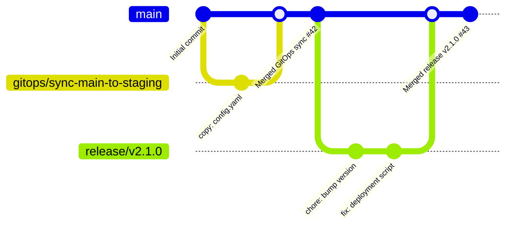

# SKILL.md — git-gitops-flow

**GitOps MVP: Auto-sync state between 1–2 repositories with drift detection, conflict resolution, and commit graph visualization.**

Version: **1.0.0** | Tier: **Sonnet** | MCPs: **GitHub (create_branch, create_pull_request, list_commits, search_code)** | Output: **Auto-created PR/Issue + Conflict Report + Commit Graph**

---

## Overview

Automated GitOps synchronization skill that maintains state consistency across multiple repositories using:
- **Drift Detection** — Compares files, branches, or structured data across 1–2 repos
- **Auto-PR Creation** — Creates pull requests with conflict resolution strategies
- **Sync Strategies** — Copy file, merge branch, rebase, three-way merge
- **Conflict Reporting** — JSON findings + human-readable issue if conflicts cannot auto-resolve
- **Commit Graph** — Visual timeline of sync operations with contributor attribution
- **MCP Integration** — GitHub create_branch/create_pull_request for automated workflows

**Use case**: Keep infrastructure-as-code repos in sync, coordinate deployments across staging/prod, maintain canonical copies of shared configs.

---

## Capability Matrix

| Feature | Supported | Strategy | Output |
|---|---|---|---|
| **Drift Detection** | ✅ File-level | Byte-exact hash compare | JSON delta report |
| **Branch Sync** | ✅ Fast-forward merge | `git merge --ff-only` simulation | Auto-created PR or issue if not FFable |
| **Rebase Sync** | ✅ Linear history | Simulate `git rebase` with conflict detection | Auto-PR or manual conflict resolution issue |
| **Three-way Merge** | ✅ Conflicted files | Detect overlapping changes | Issue with merge diff blocks |
| **File Copy** | ✅ Single/bulk files | Byte-exact replace or append | Direct commit + PR |
| **Conflict Resolution** | ⚠ Semi-auto | LCS (longest common subsequence) merge | Labeled issue + suggested patches |
| **Commit Graph** | ✅ Visualization | DAG with timestamps + authors | SVG/Mermaid diagram embed |
| **Status Reporting** | ✅ Real-time | GitHub check run | PR comment + job summary |
| **Rollback** | ✅ PR revert | GitHub merge revert | New PR or commit |

---

## Architecture

### Input Phase

1. **Repo Declaration**
   ```
   Repo A: owner/name#branch (source)
   Repo B: owner/name#branch (target)
   ```

2. **Sync Type Selection**
   - `copy-file`: Single/multiple files from A → B
   - `merge-branch`: Merge A's branch into B's branch
   - `rebase`: Rebase B on top of A
   - `three-way-merge`: Resolve conflicts via LCS
   - `detect-drift`: Report differences without syncing

3. **Conflict Strategy**
   - `auto-merge`: Attempt automatic resolution
   - `manual-review`: Create issue for human review
   - `ours`: Prefer target repo changes
   - `theirs`: Prefer source repo changes

### Processing Phase

1. **Clone/Fetch** — Retrieve both repos (or branches) via GitHub API
2. **Diff Analysis** — Compute delta using:
   - File hash comparison
   - Line-by-line diff (unified format)
   - JSON/YAML merge diff for structured data
3. **Conflict Detection** — Flag overlapping changes using three-way merge algorithm
4. **Auto-Resolution** — Apply selected strategy
5. **PR/Branch Creation** — Use GitHub MCP to create branches and PRs
6. **Reporting** — Generate commit graph + findings JSON

### Output Phase

- **If successful**: Auto-created PR with:
  - Descriptive title: `GitOps: Sync {source}#{branch} → {target}#{branch}`
  - Commit-based changelog
  - Link to commit graph
  - Status: **ready to merge** (if auto-approved) or **review required**

- **If conflicts**: GitHub issue with:
  - Conflict blocks (file:line:before:after)
  - Suggested resolution (LCS merge or manual blocks)
  - Link to draft PR
  - Blocking status

- **Always**: Commit graph SVG/Mermaid showing:
  - Timeline of syncs
  - Branch divergence/convergence
  - Author attribution
  - SHA hashes for traceability

---

## Sync Strategies

### 1. Copy File (`copy-file`)

**Use case**: Keep a single config file identical across repos.

```yaml
strategy: copy-file
source:
  repo: org/infra-main
  path: config/production.yaml
  ref: main
target:
  repo: org/infra-staging
  path: config/production.yaml
  ref: main
conflict_strategy: auto-merge
```

**Flow**:
1. Fetch `source` file from GitHub
2. Compare with `target` file (hash check)
3. If identical: No change needed
4. If different:
   - Create branch `gitops/sync-production-config-{timestamp}`
   - Copy file contents
   - Commit: `chore: sync production.yaml from infra-main`
   - Create PR with auto-merge enabled

**Outputs**:
```json
{
  "sync_type": "copy-file",
  "source_file": "config/production.yaml",
  "source_sha": "a1b2c3d4",
  "target_sha": "x9y8z7w6",
  "status": "synced",
  "pr_number": 42,
  "pr_url": "https://github.com/org/infra-staging/pull/42",
  "commit_sha": "abc123def456",
  "timestamp": "2026-07-26T10:30:00Z"
}
```

---

### 2. Merge Branch (`merge-branch`)

**Use case**: Sync a feature branch or release branch across repos.

```yaml
strategy: merge-branch
source:
  repo: org/monorepo
  branch: release/v2.1.0
target:
  repo: org/deployed-config
  branch: main
conflict_strategy: manual-review
```

**Flow**:
1. Fetch source branch HEAD commit
2. Attempt `git merge --ff-only` simulation
3. If fast-forward possible:
   - Create branch `gitops/merge-release-v2.1.0`
   - Replay commits on top of target
   - Create PR with auto-merge
4. If conflicts:
   - Create draft PR with conflict markers
   - Open GitHub issue with conflict blocks
   - Await manual resolution

**Outputs**:
```json
{
  "sync_type": "merge-branch",
  "source_branch": "release/v2.1.0",
  "source_commits": 12,
  "source_commits_list": [
    { "sha": "abc123", "author": "alice@org.com", "message": "fix: deployment issue" }
  ],
  "target_branch": "main",
  "merge_type": "fast-forward",
  "status": "synced",
  "pr_number": 43,
  "conflict_count": 0,
  "timestamp": "2026-07-26T10:30:00Z"
}
```

---

### 3. Rebase (`rebase`)

**Use case**: Linearize history by rebasing target commits on top of source.

```yaml
strategy: rebase
source:
  repo: org/canonical
  branch: main
target:
  repo: org/fork
  branch: feature/custom-overlay
conflict_strategy: auto-merge
```

**Flow**:
1. Fetch both branch HEADs
2. Find common ancestor (merge base)
3. Simulate `git rebase source/main` on target commits
4. If no conflicts:
   - Create branch `gitops/rebase-feature-custom-overlay-onto-main`
   - Replay target commits linearly
   - Create PR
5. If conflicts:
   - Report conflict hunk count
   - Create issue with suggested conflict resolution
   - Mark as **manual review required**

**Outputs**:
```json
{
  "sync_type": "rebase",
  "source_branch": "org/canonical:main",
  "target_branch": "org/fork:feature/custom-overlay",
  "merge_base_sha": "base123",
  "target_commits_to_replay": 5,
  "rebase_conflicts": 0,
  "status": "synced",
  "pr_number": 44,
  "timestamp": "2026-07-26T10:30:00Z"
}
```

---

### 4. Three-way Merge (`three-way-merge`)

**Use case**: Intelligently merge when source and target both have changes.

```yaml
strategy: three-way-merge
source:
  repo: org/upstream
  ref: main
target:
  repo: org/downstream
  ref: main
common_ancestor: auto-detect
conflict_strategy: manual-review
```

**Algorithm**:
- Find common ancestor commit
- Compute diff: ancestor → source (source changes)
- Compute diff: ancestor → target (target changes)
- Apply LCS merge:
  - Non-overlapping regions: Auto-merge
  - Overlapping regions: Flag for manual review
  - Identical changes: Accept
  - Conflicting changes: Report with context

**Outputs**:
```json
{
  "sync_type": "three-way-merge",
  "common_ancestor": "ancestor123",
  "source_ref": "org/upstream:main",
  "target_ref": "org/downstream:main",
  "files_changed": 8,
  "files_auto_merged": 6,
  "files_with_conflicts": 2,
  "conflicts": [
    {
      "file": "src/config.yaml",
      "line_range": [10, 25],
      "source_content": "key: value-from-upstream",
      "target_content": "key: value-from-downstream",
      "lcs_suggestion": "key: value-from-upstream # NOTE: custom merge"
    }
  ],
  "status": "conflict",
  "issue_number": 45,
  "issue_url": "https://github.com/org/downstream/issues/45",
  "timestamp": "2026-07-26T10:30:00Z"
}
```

---

## Conflict Resolution Strategies

### `auto-merge`

Automatically resolve if:
- No overlapping changes (changes in different files/lines)
- Both sides add the same line (idempotent)
- Source is strict ancestor of target (fast-forward)

If conflicts remain:
- Fall back to `manual-review`
- Create issue with conflict blocks

### `manual-review`

Always create issue for human review:
- List conflicted files
- Show conflict hunks with context
- Provide suggested resolutions (LCS merge)
- Link to draft PR

### `ours` / `theirs`

Deterministic resolution:
- `ours`: Keep all target changes, discard source
- `theirs`: Accept all source changes, discard target
- Use with caution — data loss possible

---

## Commit Graph

### Output Format

**SVG (Mermaid GitGraph)**:


### Metadata

```json
{
  "commit_graph": {
    "total_commits": 25,
    "sync_operations": [
      {
        "op_id": "gitops-001",
        "timestamp": "2026-07-26T10:30:00Z",
        "source_repo": "org/infra-main",
        "target_repo": "org/infra-staging",
        "strategy": "copy-file",
        "commit_sha": "abc123def456",
        "author": "gitops-bot@org.com",
        "message": "chore: sync production.yaml from infra-main",
        "pr_number": 42,
        "status": "merged"
      }
    ],
    "divergence_timeline": [
      { "date": "2026-07-20", "source_ahead": 2, "target_ahead": 0 },
      { "date": "2026-07-21", "source_ahead": 2, "target_ahead": 1 },
      { "date": "2026-07-26", "source_ahead": 0, "target_ahead": 0 }
    ]
  }
}
```

---

## Inputs & Configuration

### Minimal Configuration

```yaml
gitops:
  source:
    repo: owner/source-repo
    branch: main
    ref: null  # latest commit on branch
  target:
    repo: owner/target-repo
    branch: main
  sync_type: copy-file | merge-branch | rebase | three-way-merge | detect-drift
  file_patterns: ["config/*.yaml", "terraform/**/*.tf"]  # optional; if omitted, all files
  conflict_strategy: auto-merge | manual-review | ours | theirs
  auto_merge_pr: true | false
  labels: ["gitops", "auto-sync"]
```

### Advanced Configuration

```yaml
gitops:
  # ... (minimal fields) ...
  
  # File filtering
  ignore_patterns: [".git/**", "*.tmp"]
  preserve_history: false  # true = use merge; false = use rebase
  
  # Commit customization
  commit_prefix: "gitops: "
  author_email: "gitops@org.com"
  author_name: "GitOps Bot"
  
  # PR customization
  pr_title: "GitOps: Sync {source}#{source_branch} → {target}#{target_branch}"
  pr_description: |
    Automated GitOps sync operation.
    Strategy: {sync_type}
    Conflicts: {conflict_count}
    Review: {review_url}
  
  # Notifications
  notify_on_conflict: true
  assignees: ["devops-team"]
  reviewers: ["devops-lead"]
  
  # Scheduling
  cron_schedule: "0 10 * * 1"  # Weekly Monday 10am UTC
  dry_run: false
```

---

## MCP Tools Used

| Tool | Purpose | Called by |
|---|---|---|
| `create_branch` | Create sync branch in target repo | PR creation flow |
| `create_pull_request` | Create sync PR with description | Auto-merge flow |
| `list_commits` | Get commit details (author, message, SHA) | Commit graph generation |
| `search_code` | Find files matching patterns | File drift detection |
| `get_file_contents` | Fetch file for diff | Diff computation |
| `list_branches` | Enumerate available branches | Validation |

---

## Error Handling

### Drift Detected (No Auto-Sync)

**Scenario**: `detect-drift` returns differences but no sync is requested.

```json
{
  "operation": "detect-drift",
  "status": "drift_detected",
  "drift_count": 3,
  "files_different": [
    "config/app.yaml",
    "terraform/main.tf",
    "scripts/deploy.sh"
  ],
  "message": "Run with sync_type='copy-file' or 'merge-branch' to synchronize."
}
```

### Merge Conflict (Unresolvable)

**Scenario**: Three-way merge detects conflicting changes.

```json
{
  "operation": "merge",
  "status": "conflict",
  "conflict_count": 2,
  "issue_url": "https://github.com/owner/target-repo/issues/45",
  "message": "Manual review required. See issue #45 for conflict details."
}
```

### Branch Not Found

**Scenario**: Source or target branch does not exist.

```json
{
  "operation": "merge-branch",
  "status": "error",
  "error_code": "BRANCH_NOT_FOUND",
  "missing_branch": "release/v2.1.0",
  "repo": "owner/target-repo"
}
```

### Permission Denied

**Scenario**: GitHub token lacks write permission to target repo.

```json
{
  "operation": "create-pr",
  "status": "error",
  "error_code": "PERMISSION_DENIED",
  "message": "Token does not have push access to owner/target-repo. Ensure GitHub App is installed and has 'contents:write' permission."
}
```

---

## Usage Patterns

### Pattern 1: Canonical Sync

Keep a staged config repo in sync with the canonical upstream.

```
Input:
  source: org/canonical-infra#main
  target: org/staging-infra#main
  sync_type: copy-file
  file_patterns: ["terraform/**/*.tf"]
  schedule: "0 10 * * *"  # Daily 10am

Output:
  - Auto-PR created if drift detected
  - PR auto-merged if no conflicts
  - Commit graph shows sync timeline
```

### Pattern 2: Release Coordination

Sync a release branch across multiple deployment repos.

```
Input:
  source: org/monorepo#release/v3.0.0
  target: org/deployment-prod#main
  sync_type: merge-branch
  conflict_strategy: manual-review
  auto_merge_pr: false

Output:
  - PR created with all commits from release branch
  - Awaits manual approval before merge
  - Commit graph shows release propagation
```

### Pattern 3: Conflict Detection Only

Monitor for drift without auto-syncing.

```
Input:
  source: org/upstream-app
  target: org/fork-app
  sync_type: detect-drift
  notify_on_conflict: true

Output:
  - JSON report of drift (no PR created)
  - Issue opened if drift exceeds threshold
  - Manual sync can be triggered later
```

---

## Integration Points

### With `manta-05` (Orçamento)

Sync cost/budget configs across project repos:
```
gitops → manta-05: Pass synced SICRO/composição files
manta-05 → gitops: Request sync of updated cost baselines
```

### With `manta-07` (Cronograma)

Sync schedule baselines across projects:
```
gitops: Detect drift in project schedules
manta-07: Generate recommendations for sync strategy
```

### With CI/CD Pipelines

Trigger GitOps sync on merge to main:
```
GitHub Actions:
  on:
    push:
      branches: [main]
  jobs:
    sync:
      runs-on: ubuntu-latest
      steps:
        - uses: actions/invoke-skill@gitops-flow
          with:
            source: org/main#main
            target: org/staging#main
```

---

## Rules & Best Practices

1. **Always test in staging first**
   - Use `dry_run: true` to validate sync plan
   - Review conflict report before enabling `auto_merge_pr`

2. **Preserve audit trail**
   - All syncs create commits with GitOps attribution
   - Revert any sync via GitHub PR revert (creates new commit)

3. **Conflict resolution priority**
   - `auto-merge` for non-overlapping changes
   - `manual-review` for overlapping changes
   - Never use `ours/theirs` without human review

4. **Naming conventions**
   - Branches: `gitops/{operation}-{timestamp}` or `gitops/{target}-on-{source}`
   - Commits: `gitops: {strategy} {source} → {target}`
   - Issues: `[GitOps] Conflict in {sync operation} #{number}`

5. **Performance**
   - Limit to <1000 files per sync
   - Use `file_patterns` to narrow scope
   - Cache commit graph for repeated queries

6. **Security**
   - Use GitHub App with minimal scopes (contents:read, pull_requests:write)
   - Audit `ours/theirs` strategy usage (potential data loss)
   - Log all sync operations to Supabase `gitops_audit` table

---

## Outputs Summary

| Output | Format | Use Case |
|---|---|---|
| **Sync Report (JSON)** | Structured JSON | Machine-readable drift/sync status |
| **PR** | GitHub PR object | Review + merge sync changes |
| **Conflict Issue** | GitHub issue with diff blocks | Human-guided conflict resolution |
| **Commit Graph (Mermaid SVG)** | SVG diagram | Timeline of syncs + branch divergence |
| **Audit Log** | JSON (Supabase) | Compliance + trend analysis |

---

## Metadata

```
Skill: git-gitops-flow
Version: 1.0.0
Created: 2026-07-26
Tier: Sonnet
MCP Servers: GitHub (create_branch, create_pull_request, list_commits, search_code)
Sync Strategies: 4 (copy-file, merge-branch, rebase, three-way-merge)
Conflict Detection: LCS-based three-way merge
Output Formats: JSON, GitHub PR/Issue, Mermaid SVG, Audit log
Use Cases: GitOps, multi-repo sync, release coordination, drift detection
GitHub Scopes Required: contents:read, contents:write, pull_requests:write, issues:write
Logging: Supabase `gitops_operations`, `gitops_conflicts`, `gitops_audit`
Classification: Horizontal Skill — Manta Associados
```
