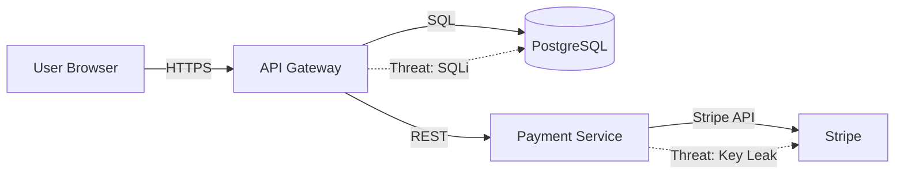

# Git Threat Modeling

**Version:** 1.0.0  
**Tier:** Sonnet  
**Manta Code:** Sec-THREAT-01  
**Updated:** 2026-07-26

## Overview

Architectural threat analysis using STRIDE framework. Identifies security risks in software architecture, generates Data Flow Diagrams (DFDs), maps threats to OWASP Top 10, and produces remediation checklists.

**When to Use:**
- "Threat model this repository"
- "Security architecture review"
- "Identify attack surface"
- "Map data flows for compliance"
- "Risk assessment before deployment"

## STRIDE Framework

### **S**poofing (Identity Falsification)
- MitM attacks, session hijacking, impersonation
- Controls: mTLS, certificate pinning, session tokens

### **T**ampering (Data Alteration)
- SQL injection, code injection, race conditions
- Controls: input validation, parameterized queries, serialization checks

### **R**epudiation (Denial of Actions)
- Audit log deletion, log tampering
- Controls: immutable logging, digital signatures, blockchain audit

### **I**nformation Disclosure (Data Exposure)
- PII leakage, timing attacks, cache attacks
- Controls: encryption, access controls, secure headers

### **D**enial of Service (Resource Exhaustion)
- DDoS, ReDoS, memory exhaustion
- Controls: rate limiting, input size limits, timeouts

### **E**levation of Privilege (Authz Bypass)
- IDOR, privilege escalation, CVE exploitation
- Controls: RBAC, least privilege, CVE patching

## Inputs

```json
{
  "codebase_path": "github.com/org/repo",
  "scope": "microservices",
  "architecture_diagram_url": "https://example.com/arch.png",
  "critical_actors": ["users", "admins", "payment-processor", "analytics-service"],
  "data_types": ["PII", "payment_info", "API_keys", "session_tokens"],
  "compliance_context": ["GDPR", "PCI-DSS", "SOC2"],
  "threat_priority": "CVSS",
  "output_formats": ["json", "dfd", "html"]
}
```

## Outputs

### 1. JSON Threat Report
```json
{
  "threats": [
    {
      "id": "STRIDE-01",
      "category": "Spoofing",
      "description": "Session hijacking via XSS",
      "affected_component": "api-gateway",
      "cvss_score": 7.5,
      "likelihood": "high",
      "existing_controls": ["HTTPS", "HttpOnly cookies"],
      "missing_controls": ["CSP headers", "rate limiting"],
      "remediation": "Implement CSP + rate limiting on token endpoints",
      "compliance_mapping": ["GDPR Article 32", "PCI-DSS 6.5.7"]
    }
  ]
}
```

### 2. Data Flow Diagram (Mermaid)


### 3. HTML Interactive Dashboard
- Filterable threat list by severity/category
- DFD visualization with threat overlays
- Remediation checklist with progress tracking
- Compliance requirement mapping

### 4. Remediation Checklist
- [ ] Threat STRIDE-01: Implement CSP headers
  - Owner: Backend team
  - Deadline: 2026-08-15
  - Effort: 4 hours

## Scenario 1: REST API + PostgreSQL

**Components:**
- User Browser, API Gateway, PostgreSQL DB, Stripe API

**Key STRIDE Threats:**
1. Spoofing: Session hijacking (missing CSRF tokens)
2. Tampering: SQL injection in user search
3. Information Disclosure: API keys hardcoded in code
4. DoS: No rate limiting on login endpoint
5. Elevation: Admin bypass via IDOR on user profile

**Output:** JSON report with 12 threats, DFD, remediation steps

## Scenario 2: Kubernetes Microservices

**Components:**
- Ingress (nginx), Auth Service, API Service, Database, Kafka, Vault

**Key STRIDE Threats:**
1. Spoofing: Unencrypted inter-service communication
2. Tampering: Kafka message tampering (no signatures)
3. Repudiation: Missing audit logs in Vault
4. Information Disclosure: Secrets in environment variables
5. DoS: No Pod resource limits (CrashLoopBackOff)
6. Elevation: Service account with cluster-admin role

**Output:** JSON report with 18+ threats, DFD, remediation timeline (W1-W4)

## Integration with Manta

| Agent | Trigger | Handoff |
|-------|---------|---------|
| manta-02 (Contratual) | Compliance violation (GDPR, PCI-DSS) | Update contract terms + RFP responses |
| manta-05 (Orçamento) | Remediation cost estimation | Budget allocation + ROI analysis |
| manta-15 (Advisory) | Strategic risk assessment | War gaming + market risk analysis |
| agente-06 (Modelagem) | Data flow complexity | Financial model impact analysis |

## Limitations

⚠️ **Human Interpretation Required**
- Component identification may miss implicit elements
- Threat classification needs validation against codebase
- Severity/risk requires organizational context
- Control effectiveness needs manual assessment
- Remediation prioritization needs business judgment

**Pre-requisites:**
- Code repository access
- Architecture clarity (no reverse-engineering from code)
- Security expertise for validation

## Related Skills

- `git-incident-response` — Respond to identified threats
- `git-code-pattern-detection` — Detect vulnerable code patterns
- `git-pr-autoreview` — Scan for threat indicators in PRs
