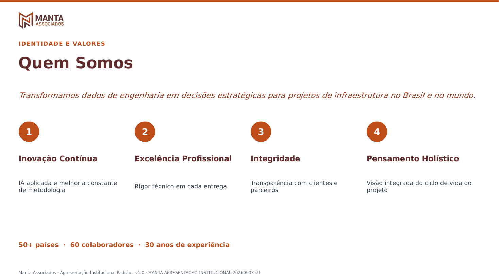
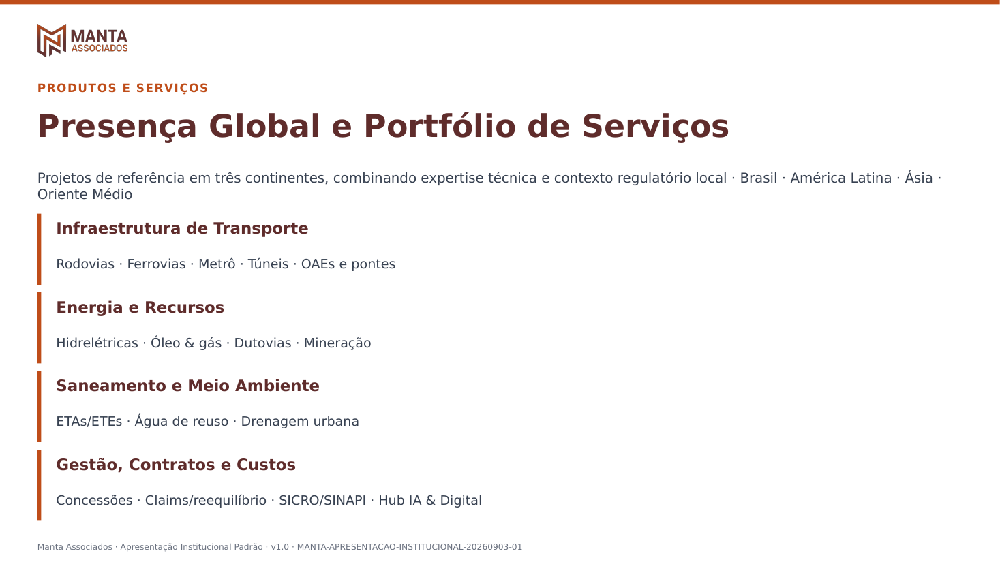
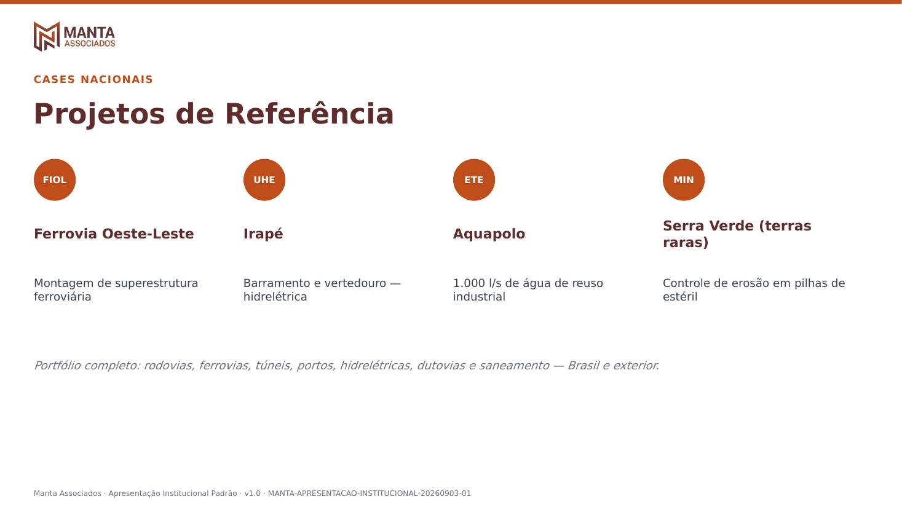
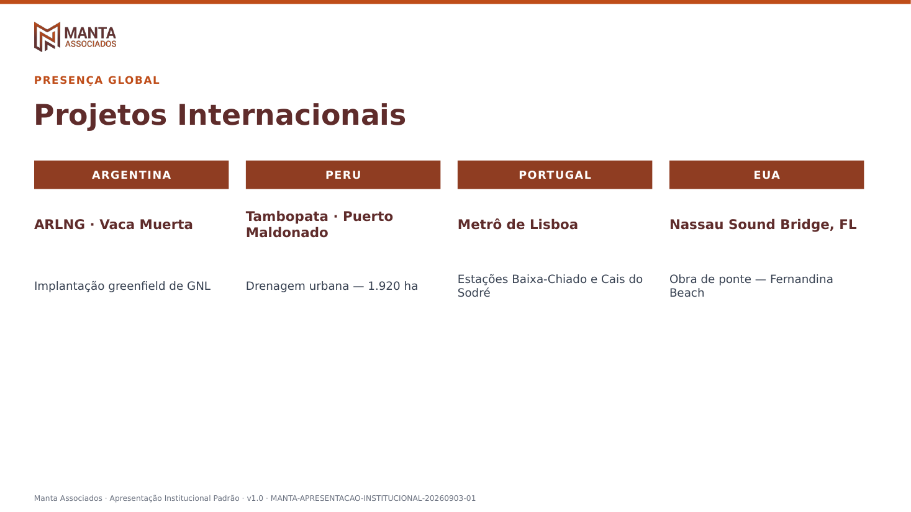
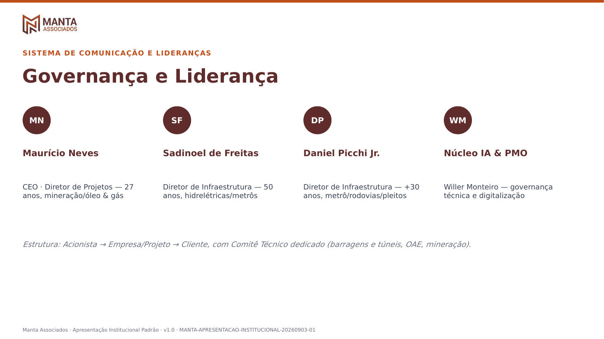
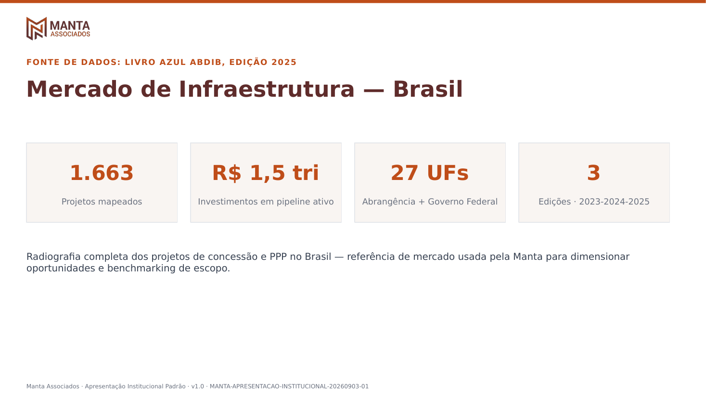
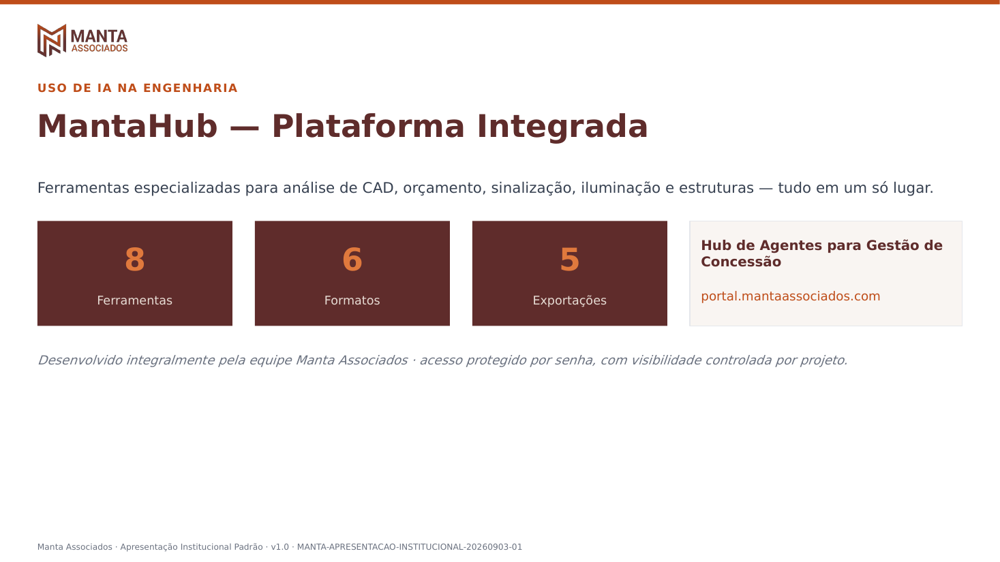
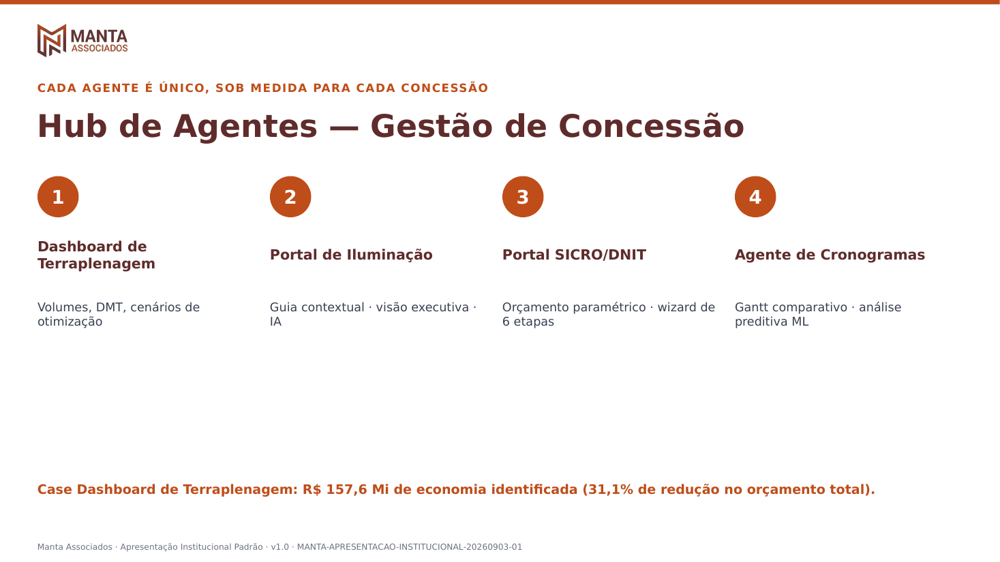
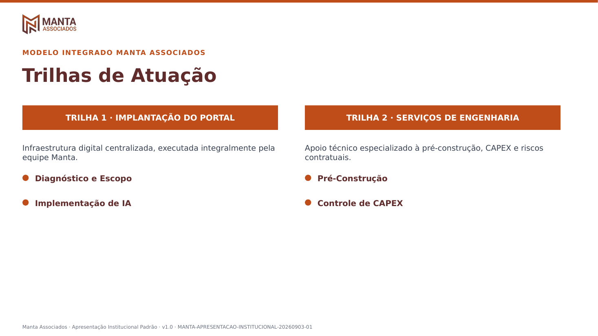

# Padrão de apresentação institucional — Manta Associados

Referência canônica da apresentação institucional padrão da Manta
Associados, usada quando **não há cliente específico** (a Manta se
apresentando como empresa — pitch, kickoff, portal institucional,
material de divulgação genérico). Distinta dos padrões de output por
cliente (ex.: [`PADRAO-OUTPUT-MOTIVA.md`](PADRAO-OUTPUT-MOTIVA.md)),
que se aplicam a entregáveis técnicos de um projeto/contrato
específico.

Fonte original: PDF institucional fornecido diretamente por MN,
`ABR_APR_INST_MANTA_Nova.pdf` (24 slides, formato 16:9), cobrindo
identidade da empresa, presença global, portfólio de projetos
(nacionais e internacionais), governança/liderança, mercado brasileiro
de infraestrutura (Livro Azul ABDIB) e o MantaHub/Hub de Agentes para
gestão de concessão.

**Template implementado** (v1.0, 2026-09-03, conteúdo aprovado por MN):

- [`templates/APRESENTACAO-INSTITUCIONAL-PADRAO-MANTA.pptx`](templates/APRESENTACAO-INSTITUCIONAL-PADRAO-MANTA.pptx) —
  11 slides, condensação das 24 páginas fonte.
- [`templates/examples/apresentacao-institucional-manta/`](templates/examples/apresentacao-institucional-manta/) —
  galeria com o render de cada slide em PNG (ver seção "Galeria de
  exemplos" abaixo) + `base64-manifest.json` com todas as imagens
  codificadas em base64, para uso onde arquivo de imagem não é
  acessível diretamente (ingestão em RAG/MantaHub, exemplos few-shot
  para o `agente-apresentacoes`, embutir em outro artefato).

## Regra de condensação — "4 elementos por slide"

Pedido explícito de MN: a apresentação padrão deve trazer no máximo
**4 elementos de conteúdo por slide** (bullets, KPIs, cards ou colunas
— o que for a unidade do slide). Isso é mais restritivo que o teto
"5-6 elementos por slide" já documentado na skill `padrao-manta` v3
para PPTX — logo, todo slide que segue esta regra automaticamente
respeita também o padrão geral da skill.

Cada um dos 11 slides do template segue esse teto:

| # | Slide | Unidade de conteúdo (≤4) |
|---|-------|---------------------------|
| 1 | Capa | 3 KPIs (países · colaboradores · anos) |
| 2 | Quem Somos | 4 valores (Inovação Contínua · Excelência Profissional · Integridade · Pensamento Holístico) |
| 3 | Presença Global e Portfólio de Serviços | 4 clusters de serviço (Transporte · Energia e Recursos · Saneamento · Gestão/Contratos/Custos) |
| 4 | Projetos de Referência | 4 cases nacionais (FIOL · UHE Irapé · Aquapolo · Serra Verde) |
| 5 | Projetos Internacionais | 4 cases (Argentina · Peru · Portugal · EUA) |
| 6 | Governança e Liderança | 4 papéis (CEO · 2 Diretores de Infraestrutura · Núcleo IA/PMO) |
| 7 | Mercado de Infraestrutura — Brasil | 4 KPIs do Livro Azul ABDIB |
| 8 | MantaHub — Plataforma Integrada | 3 KPIs + 1 card do Hub de Agentes |
| 9 | Hub de Agentes — Gestão de Concessão | 4 ferramentas (Dashboard Terraplenagem · Portal Iluminação · Portal SICRO/DNIT · Agente Cronogramas) |
| 10 | Trilhas de Atuação | 2 trilhas × 2 destaques = 4 itens |
| 11 | Encerramento | logo + tagline (sem lista) |

## Identidade visual

Segue a paleta oficial da Manta (skill `padrao-manta` v3), confirmada
visualmente contra o PDF fonte:

| Uso | Cor |
|---|---|
| Destaque principal / KPIs | Terracota `#BF4D19` |
| Extremo claro (hover, KPI sobre fundo escuro) | Terracota clara `#E0793D` |
| Títulos, fundo de capa/encerramento | Vinho `#5F2C2B` |
| Subtítulos de seção | Marrom médio `#8F3D22` |
| Texto de corpo | Cinza texto `#374151` |

**Logo**: extraído diretamente do PDF fonte (imagem RGB + soft mask
combinados via `pdfimages` + `Pillow`, não desenhado do zero) — versão
colorida para fundo claro, versão branca (recomposta a partir do
próprio canal alfa) para fundo escuro (capa/encerramento). Nenhuma
versão placeholder foi usada.

Regras de layout herdadas da skill `padrao-manta` (seção "PPTX"):
fundo branco nos slides de conteúdo, faixa terracota de 4px no topo,
título à esquerda em negrito, bullets curtos (nunca blocos de texto),
rodapé discreto com metadados de rastreabilidade. Capa e encerramento
usam fundo vinho sólido, no mesmo estilo do PDF fonte.

## Geração e QA

Gerado com `pptxgenjs` (script não versionado — reproduzível a partir
deste documento + do PDF fonte). Validação aplicada antes da entrega:

1. `scripts/office/validate.py` (skill `pptx`) — schema/relações OOXML: **passou**.
2. `markitdown` — conteúdo texto de todos os 11 slides, checado contra
   placeholder/lorem/TODO: **nenhum encontrado**.
3. QA visual — conversão para PDF (LibreOffice) + `pdftoppm`, inspeção
   de todas as 11 páginas renderizadas. Duas rodadas: a primeira
   encontrou (a) fundo preto atrás do logo (soft mask mal interpretado
   como imagem própria — corrigido recompondo RGB+alpha real) e (b)
   sobreposição do kicker de seção com a base do logo em todo slide de
   conteúdo — corrigido ajustando o espaçamento vertical do cabeçalho;
   a segunda rodada, após os ajustes, também achou um cartão do slide
   "MantaHub" ultrapassando a margem direita do slide — corrigido
   recalculando a largura do cartão a partir do espaço realmente
   disponível.

## Galeria de exemplos

Render de cada um dos 11 slides (PNG, 110dpi), para consulta visual
direta sem precisar abrir o `.pptx`. Arquivos em
`templates/examples/apresentacao-institucional-manta/`.

| # | Slide | Preview |
|---|-------|---------|
| 1 | Capa |  |
| 2 | Quem Somos — 4 valores |  |
| 3 | Presença Global e Portfólio de Serviços |  |
| 4 | Projetos de Referência |  |
| 5 | Projetos Internacionais |  |
| 6 | Governança e Liderança |  |
| 7 | Mercado de Infraestrutura — Brasil |  |
| 8 | MantaHub — Plataforma Integrada |  |
| 9 | Hub de Agentes — Gestão de Concessão |  |
| 10 | Trilhas de Atuação |  |
| 11 | Encerramento |  |

Logo real extraído do PDF fonte (RGB + soft mask recompostos,
transparência real — ver seção "Identidade visual"):
[`logo-manta-color.png`](templates/examples/apresentacao-institucional-manta/logo-manta-color.png)
(fundo claro) e
[`logo-manta-white.png`](templates/examples/apresentacao-institucional-manta/logo-manta-white.png)
(fundo escuro).

### Manifesto base64

[`templates/examples/apresentacao-institucional-manta/base64-manifest.json`](templates/examples/apresentacao-institucional-manta/base64-manifest.json)
traz as 11 imagens de slide + os 2 logos, cada um como `data URI`
`image/png` em base64, num único JSON (`itens[].base64`). Use este
manifesto (em vez dos arquivos `.png` soltos) quando o consumidor não
tiver acesso a arquivo — por exemplo, ingestão como exemplo few-shot no
`agente-apresentacoes`, carga em uma coleção RAG do Manta Maestro, ou
embutir a imagem diretamente em outro artefato HTML/JSON sem depender
de um caminho de arquivo.

## Uso pelos agentes

Referenciado em `agente-apresentacoes.md` (Manta 14) como o template
padrão a usar sempre que a solicitação for institucional/sem cliente
(pitch da empresa, kickoff genérico, material de divulgação). Para
entregáveis de cliente específico, o agente continua consultando
primeiro o padrão de output daquele cliente (ex.: Motiva) — este
documento nunca substitui um padrão de cliente já definido.

## Pendências

- ~~**Gate humano MN**: aprovação do conteúdo condensado~~ — **aprovado
  por MN em 2026-09-03**, conferido contra o PDF fonte reenviado na
  mesma sessão. Padrão considerado operacional.
- **Upload para o SharePoint da equipe**: o template existe apenas
  versionado neste repositório; o MCP SharePoint disponível hoje é
  somente leitura, então a cópia para
  `sites/Engenharia/.../04_IA/Manta-Maestro/` é uma ação manual (mesma
  limitação já registrada para os templates Motiva).
