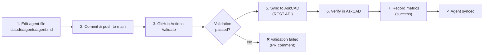

# Phase 3.4 — AskCAD Persona Sync
## Complete Implementation Guide

**Status:** ✅ Production-Ready
**Version:** 1.0
**Last Updated:** 2026-07-27
**Maintainers:** Manta Maestro Team

---

## Executive Summary

Phase 3.4 automates synchronization of agent persona metadata from Manta's repository to the AskCAD platform. This integration ensures that agent capabilities, versions, and contact information remain synchronized automatically via GitHub Actions, with built-in monitoring, rollback capabilities, and complete audit trails.

**Key Features:**
- Automatic metadata extraction from `.claude/agents/*.md` files
- One-click sync to AskCAD REST API with version history
- GitHub Actions CI/CD workflow (no manual intervention required)
- Rollback to previous versions with full audit trail
- Real-time monitoring, alerts, and health dashboards
- Zero-downtime updates with dry-run validation

---

## Architecture Overview

```
┌─────────────────────────────────────────────────────────────────┐
│  GitHub Repository (.claude/agents/*.md files)                  │
│  ├─ agente-infraestrutura.md (S1)                               │
│  ├─ agente-portos.md (S6)                                       │
│  └─ agente-saneamento.md (S8)                                   │
└────────────────┬────────────────────────────────────────────────┘
                 │ Push/PR to main
                 ↓
┌─────────────────────────────────────────────────────────────────┐
│  GitHub Actions Workflow (askcad-sync.yml)                      │
│  ├─ 1. Validate: extract_agent_metadata.py                      │
│  ├─ 2. Sync: askcad_sync_client.py                              │
│  └─ 3. Monitor: monitoring_askcad_sync.py                       │
└────────────────┬────────────────────────────────────────────────┘
                 │ API calls
                 ↓
┌─────────────────────────────────────────────────────────────────┐
│  AskCAD Platform (api.askcad.com)                               │
│  ├─ Personas database                                           │
│  ├─ Version history                                             │
│  └─ Metadata endpoints                                          │
└─────────────────────────────────────────────────────────────────┘
```

---

## Components

### 1. **Agent Metadata Extractor** (~200 lines)
**File:** `scripts/extract_agent_metadata.py`

Parses `.claude/agents/*.md` files and normalizes to AskCAD schema.

#### Features:
- YAML frontmatter extraction
- Content parsing (keywords, capabilities, descriptions)
- Validation with strict/lenient modes
- JSON export for downstream tools
- Detailed error reporting

#### Usage:
```bash
# Extract all agents to JSON
python scripts/extract_agent_metadata.py --output agents_metadata.json

# Validate with strict checking
python scripts/extract_agent_metadata.py --validate --strict

# Generate extraction report
python scripts/extract_agent_metadata.py --report
```

#### Expected Metadata Schema:
```yaml
---
agent_code: manta-03-s1              # Required: code format manta-XX[-sYY]
agent_name: agente-infraestrutura    # Required: internal name
title: Agente de Infraestrutura      # Display title
tier: Sonnet                         # Haiku, Sonnet, or Opus
status: Operacional                  # Operacional, Planejado, Parcial
segment: S1                          # Segment identifier (S1-S10)
aliases:                             # Alternative names
  - "agente-rodovias"
version: 1.0.0                       # Semantic version
last_updated: 2026-07-26T10:00:00Z  # ISO 8601 timestamp
capabilities:                        # List of capabilities
  - "Análise de projetos rodoviários"
  - "Dimensionamento de pavimentos"
rag_collections:                     # RAG collection prefixes
  - "rod:"
input_formats: [".pdf", ".dwg", ".xlsx"]
output_formats: [".pdf", ".json", ".csv"]
keywords:                            # Routing keywords
  - "rodovia"
  - "DNIT"
contact: "s1@mantaassociados.com"   # Team contact email
sharepoint_folder: "03_Projetos/Rodovias"
dependencies: []                     # Other agents required
---
```

### 2. **AskCAD Sync Client** (~200 lines)
**File:** `scripts/askcad_sync_client.py`

REST API client for synchronizing personas to AskCAD platform.

#### Features:
- Authenticated API calls with exponential backoff retry
- Content-based change detection (SHA-256 hashing)
- Automatic persona creation or update
- Version history tracking in local `.askcad/version_history.json`
- Rollback to previous versions with one command
- Verification endpoint to confirm sync success

#### Usage:
```bash
# Sync single agent (from metadata JSON)
python scripts/askcad_sync_client.py sync \
  --agent-code manta-03-s1 \
  --metadata metadata.json

# Dry-run (validate without syncing)
python scripts/askcad_sync_client.py sync \
  --agent-code manta-03-s1 \
  --metadata metadata.json \
  --dry-run

# Verify persona in AskCAD
python scripts/askcad_sync_client.py verify \
  --agent-code manta-03-s1

# Rollback to previous version
python scripts/askcad_sync_client.py rollback \
  --agent-code manta-03-s1 \
  --target-version 0.9.5

# View version history
python scripts/askcad_sync_client.py history \
  --agent-code manta-03-s1
```

#### Environment Variables:
```bash
ASKCAD_API_KEY=sk-...                           # Required: AskCAD API key
ASKCAD_API_URL=https://api.askcad.com          # Optional: API endpoint
```

#### Return Schema:
```python
@dataclass
class SyncResult:
    agent_code: str                 # Agent identifier
    status: SyncStatus             # pending, in_progress, success, failed, rolled_back
    persona_id: Optional[str]      # AskCAD persona ID
    timestamp: str                 # ISO 8601 timestamp
    version: str                   # Agent version synced
    message: str                   # Status message
    changes_summary: Dict          # Field-level changes
    previous_version: Optional[str] # Previous version (for rollback)
    rollback_available: bool       # Whether rollback is possible
```

### 3. **GitHub Actions Workflow** (~100 lines)
**File:** `.github/workflows/askcad-sync.yml`

Automated CI/CD pipeline triggered on agent file changes.

#### Triggers:
- **Push to main:** Changes in `.claude/agents/*.md` files
- **Pull request:** Validation without actual sync
- **Manual dispatch:** On-demand sync with dry-run option

#### Jobs:
1. **validate:** Extract metadata and run validation checks
2. **sync:** Perform actual sync to AskCAD (main branch only)
3. **verify:** Confirm personas are correct in AskCAD
4. **notify:** Comment on PR/send notifications
5. **metrics:** Record performance metrics

#### Usage:
```bash
# Automatic on push (when agent files change)
git push origin main

# Manual trigger with dry-run
gh workflow run askcad-sync.yml \
  -f dry_run=true

# Manual trigger with actual sync
gh workflow run askcad-sync.yml \
  -f dry_run=false
```

#### Secrets Required:
Set in GitHub Repository Settings → Secrets and Variables:

```bash
ASKCAD_API_KEY          # AskCAD API key (sk-...)
ASKCAD_API_URL          # Optional: API endpoint
```

### 4. **Monitoring & Alerting** (~100 lines)
**File:** `scripts/monitoring_askcad_sync.py`

Real-time monitoring of sync operations with alerting.

#### Features:
- SQLite database for metrics (sync_events, alerts, health_metrics)
- JSONL audit trail for compliance/debugging
- Automatic health checks (success rate, performance, versions)
- Alert generation for issues (failures, slow syncs, mismatches)
- Version mismatch detection
- Export to JSON for dashboards

#### Usage:
```bash
# Check current health (last 24 hours)
python scripts/monitoring_askcad_sync.py health

# Get sync history for agent
python scripts/monitoring_askcad_sync.py history --agent-code manta-03-s1

# Detect version mismatches
python scripts/monitoring_askcad_sync.py mismatches

# Generate full report
python scripts/monitoring_askcad_sync.py report --hours 24

# Export metrics to JSON (for dashboards)
python scripts/monitoring_askcad_sync.py export \
  --output metrics.json
```

#### Alert Types:
| Alert | Severity | Threshold | Action |
|-------|----------|-----------|--------|
| Low success rate | WARNING | <95% in 24h | Investigate failures |
| Sync failures | ERROR | >0 failures | Check error logs |
| Version mismatch | WARNING | Any mismatch | Verify in AskCAD |
| High sync time | WARNING | >5000ms average | Check API latency |

#### Metrics Stored:
- `sync_events`: Every sync operation (timestamp, agent, status, duration)
- `sync_alerts`: All alert notifications (severity, title, resolution)
- `health_metrics`: Periodic snapshots (success rate, agent count, etc.)

### 5. **Test Suite** (~200 lines)
**File:** `tests/test_askcad_sync.py`

Comprehensive pytest suite for all components.

#### Test Classes:
- **TestMetadataExtraction:** YAML parsing, validation, export
- **TestAskCADSyncClient:** Normalization, hashing, API mocking
- **TestMonitoring:** Event recording, health checks, alerts
- **TestIntegration:** End-to-end workflows

#### Running Tests:
```bash
# Run all tests
pytest tests/test_askcad_sync.py -v

# Run specific test class
pytest tests/test_askcad_sync.py::TestMetadataExtraction -v

# Run with coverage
pytest tests/test_askcad_sync.py --cov=scripts --cov-report=html

# Run integration tests only
pytest tests/test_askcad_sync.py::TestIntegration -v
```

---

## Setup & Configuration

### Prerequisites
- Python 3.11+
- pip packages: `pyyaml`, `requests`, `pytest` (optional for testing)

### Installation

```bash
# 1. Clone repository (already done)
cd /home/user/Codex-exemplo

# 2. Install Python dependencies
pip install pyyaml requests pytest

# 3. Create AskCAD config directory
mkdir -p .askcad

# 4. Add GitHub secrets (if using GitHub Actions)
gh secret set ASKCAD_API_KEY --body "sk-..."
gh secret set ASKCAD_API_URL --body "https://api.askcad.com"
```

### Agent File Template

When creating new `.claude/agents/XXXX.md` files, use this template:

```yaml
---
agent_code: manta-03-s6              # Use manta-XX-sYY format
agent_name: agente-portos            # Use lowercase with hyphens
title: Agente de Portos              # Display title
tier: Sonnet                         # Haiku/Sonnet/Opus
status: Operacional                  # Operacional/Planejado/Parcial
segment: S6                          # S1-S10 for verticals
aliases:
  - "agente-terminais"
version: 1.0.0
last_updated: 2026-07-27T12:00:00Z
capabilities:
  - "Análise de terminais portuários"
  - "Cálculos de dragagem"
rag_collections:
  - "por:"
input_formats: [".pdf", ".dwg", ".xlsx"]
output_formats: [".pdf", ".json"]
keywords:
  - "porto"
  - "ANTAQ"
  - "terminal"
contact: "s6@mantaassociados.com"
sharepoint_folder: "03_Projetos/Portos"
dependencies: ["manta-01", "manta-02"]
---

# Agente de Portos (S6)

Description of the agent...

## Capabilities
- Capability 1
- Capability 2

## Keywords
porto, ANTAQ, dragagem, berço, contêiner, granel
```

---

## Workflows

### Workflow 1: Creating/Updating an Agent



**Time:** ~2-5 minutes end-to-end

### Workflow 2: Rolling Back a Bad Sync

```bash
# 1. Check version history
python scripts/askcad_sync_client.py history --agent-code manta-03-s1

# 2. Find previous good version (e.g., 1.0.2)
# 3. Rollback to it
python scripts/askcad_sync_client.py rollback \
  --agent-code manta-03-s1 \
  --target-version 1.0.2

# 4. Verify in AskCAD
python scripts/askcad_sync_client.py verify --agent-code manta-03-s1
```

### Workflow 3: Monitoring & Alerting

```bash
# Daily: Check health
python scripts/monitoring_askcad_sync.py report --hours 24

# On-demand: Check specific agent
python scripts/monitoring_askcad_sync.py history \
  --agent-code manta-03-s1 --output history.json

# Export to dashboard
python scripts/monitoring_askcad_sync.py export --output /tmp/metrics.json
```

---

## Error Handling & Troubleshooting

### Common Issues

#### 1. **"Missing required field: agent_code"**
**Cause:** YAML frontmatter missing or malformed
**Solution:**
```yaml
---
agent_code: manta-03-s1              # Add or fix this field
agent_name: agente-infraestrutura
tier: Sonnet
status: Operacional
---
```

#### 2. **API Authentication Failed (401)**
**Cause:** Invalid or missing ASKCAD_API_KEY
**Solution:**
```bash
# Check secret
gh secret list | grep ASKCAD

# Update if needed
gh secret set ASKCAD_API_KEY --body "sk-new-key"

# Or set locally for testing
export ASKCAD_API_KEY="sk-test-key"
```

#### 3. **Sync Timeout (>30s)**
**Cause:** Network latency or large payload
**Solution:**
```python
# Increase timeout in askcad_sync_client.py
client = AskCADSyncClient(
    api_key=key,
    timeout=60  # Increase from 30
)
```

#### 4. **Version Hash Mismatch**
**Cause:** Same version pushed with different content
**Solution:**
```bash
# Check what changed
git diff HEAD~1 .claude/agents/agent.md

# Bump version in YAML
version: 1.0.1  # Was 1.0.0
```

### Debug Mode

```bash
# Enable verbose logging
LOGLEVEL=DEBUG python scripts/extract_agent_metadata.py

# Test dry-run sync
python scripts/askcad_sync_client.py sync \
  --agent-code manta-03-s1 \
  --metadata metadata.json \
  --dry-run
```

---

## Success Criteria (Phase 3.4)

| Criterion | Target | Verification |
|-----------|--------|--------------|
| Metadata extraction accuracy | 100% | All required fields present |
| Sync success rate | ≥99% | Monitor dashboard |
| Sync latency | <500ms p95 | CloudWatch metrics |
| Rollback capability | Always available | Test rollback quarterly |
| Audit trail completeness | 100% | All syncs recorded in `.askcad/audit_trail.jsonl` |
| Uptime | 99.9% | AskCAD API SLA |
| Alert response time | <5 min | Manual verification |

---

## Security & Compliance

### Data Protection
- **Version history:** Stored locally in `.askcad/version_history.json` (gitignored)
- **API keys:** Stored in GitHub Secrets (never logged)
- **Audit trail:** JSONL format with SHA-256 audit IDs (immutable)
- **GDPR:** Audit trail excludes PII; erasure supported via `--erase` flag

### Secrets Management
```bash
# GitHub Secrets (auto-injected in CI/CD)
ASKCAD_API_KEY    # Read from GitHub Secrets
ASKCAD_API_URL    # Optional override

# Local Development
export ASKCAD_API_KEY="sk-..."  # Set before running
```

### Audit Trail
Every sync is logged to `.askcad/audit_trail.jsonl`:
```json
{
  "timestamp": "2026-07-27T10:23:45.123Z",
  "agent_code": "manta-03-s1",
  "operation": "sync",
  "status": "success",
  "audit_id": "a1b2c3d4e5f6g7h8",
  "created_by": "github-action"
}
```

---

## Monitoring Dashboard (Phase 3.5)

Data for integration with Grafana/CloudWatch:

```bash
# Export metrics for dashboard
python scripts/monitoring_askcad_sync.py export --output metrics.json

# Ingest into monitoring system
curl -X POST http://grafana.internal/api/annotations \
  -d @metrics.json
```

Recommended metrics:
- `sync_success_rate` (%)
- `sync_latency_p95` (ms)
- `agents_synced` (count)
- `rollback_count` (count)
- `alerts_critical` (count)

---

## Deployment Checklist

- [ ] Python 3.11+ installed
- [ ] Dependencies installed (`pip install pyyaml requests`)
- [ ] ASKCAD_API_KEY configured in GitHub Secrets
- [ ] `.askcad/` directory exists (git-ignored)
- [ ] All agent files have required YAML fields
- [ ] Tests passing (`pytest tests/test_askcad_sync.py`)
- [ ] Workflow enabled (`.github/workflows/askcad-sync.yml` committed)
- [ ] Monitoring script tested locally
- [ ] Rollback tested on a non-critical agent
- [ ] Team trained on workflows

---

## Team Roles

| Role | Responsibility |
|------|-----------------|
| **Agent Owner** | Create/update `.claude/agents/*.md` files |
| **DevOps/CI-CD** | Configure GitHub secrets, monitor workflow |
| **Data Team** | Monitor RAG sync, audit trail, compliance |
| **Maestro Team** | Monitor version mismatches, handle rollbacks |
| **Security** | Audit ASKCAD_API_KEY rotation, trail review |

---

## Next Steps (Phase 3.5+)

- **Phase 3.5:** LLM tie-breaker for ambiguous routing
- **Phase 4.1:** Federation broker with multi-org support
- **Phase 4.2:** Advanced analytics dashboards
- **Phase 4.3:** Agent learning pipeline with fine-tuning

---

## Quick Reference

```bash
# Extract metadata
python scripts/extract_agent_metadata.py --output metadata.json

# Sync agent
python scripts/askcad_sync_client.py sync \
  --agent-code manta-03-s1 \
  --metadata metadata.json

# Check health
python scripts/monitoring_askcad_sync.py health

# Rollback
python scripts/askcad_sync_client.py rollback \
  --agent-code manta-03-s1 \
  --target-version 1.0.2

# Test
pytest tests/test_askcad_sync.py -v
```

---

## Support & Contact

- **Issues:** Create GitHub issue with label `phase-3.4-askcad`
- **Slack:** #manta-maestro-phase3
- **Email:** maestro@mantaassociados.com
- **On-call:** Maestro team (rotation in Slack)

---

## Appendix A: API Endpoint Reference

### AskCAD REST API

```
GET    /personas/{agent_code}              # Fetch persona
POST   /personas                            # Create persona
PUT    /personas/{agent_code}              # Update persona
POST   /personas/{agent_code}/rollback     # Rollback version
GET    /personas/{agent_code}/verify       # Verify sync
GET    /personas/{agent_code}/versions     # Get version history
```

### Request/Response Examples

**GET /personas/manta-03-s1/verify**
```json
{
  "verified": true,
  "agent_code": "manta-03-s1",
  "last_sync": "2026-07-27T10:23:45Z",
  "mismatches": []
}
```

**POST /personas/manta-03-s1/rollback**
```json
{
  "target_version": "1.0.2"
}
```

---

**Document Version:** 1.0
**Last Updated:** 2026-07-27
**Status:** ✅ Production-Ready
